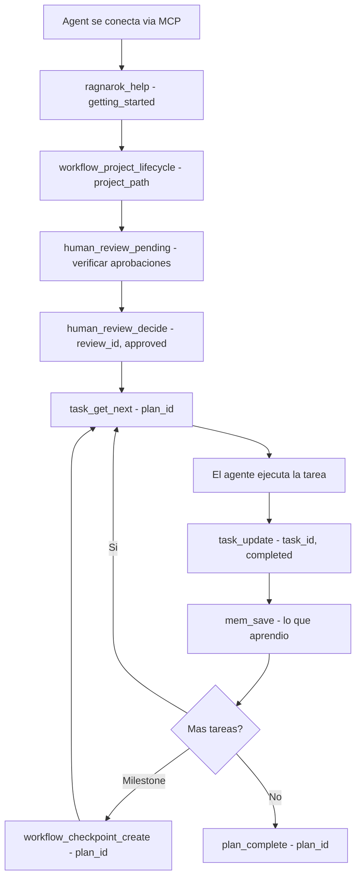

# Planificación Final — Ragnarok Ecosystem

> **Versión**: 1.0 | **Fecha**: 2026-03-29 | **Autor**: Análisis Automatizado de Código

---

## 1. Resumen Ejecutivo

Ragnarok es un ecosistema MCP de 4 módulos que orquesta agentes IA para desarrollo de software. Tras un análisis profundo del código fuente (>15,000 LOC analizadas), se identificaron **problemas críticos** que impiden la correcta operación con agentes de IDEs como Cursor, Windsurf, Antigravity, OpenCode y Claude Code.

### Hallazgos Clave

| Severidad | Hallazgos | Impacto |
|-----------|-----------|---------|
| 🔴 Crítico | 6 bugs | Herramientas no ejecutables, crashes, herramientas fantasma |
| 🟠 Alto | 5 mejoras | Herramientas invisibles, protocolos MCP incompletos |
| 🟡 Medio | 4 mejoras | UX de agentes, descripciones pobres, versión obsoleta |
| 🟢 Bajo | 3 mejoras | Código dead, inconsistencias menores |

---

## 2. Arquitectura Actual

```
cmd/rag/main.go                    ← CLI + MCP entrypoint (2500+ LOC)
internal/mcp/unified/
  server.go                        ← Unified MCP server (710 LOC)
  workflow_handlers.go             ← 10 workflow handlers (1350 LOC)
internal/fenrir/mcp/               ← Memory: 24 handlers
internal/hati/mcp/                 ← Planning: 32 handlers
internal/skoll/mcp/                ← Orchestration: 33 handlers
internal/tyr/mcp/                  ← Quality: 15 handlers
```

### Inventario de Herramientas MCP

| Módulo | Handlers Registrados | Schemas en Unified | Descripciones en Unified | Estado |
|--------|---------------------|-------------------|-------------------------|--------|
| **Fenrir** | 24 | 13 | 13 | ⚠️ Parcial |
| **Hati** | 32 | 26 | 22 | ⚠️ Parcial |
| **Skoll** | 33 | 13 | 11 | 🔴 Crítico |
| **Tyr** | 15 | 13 | 13 | ✅ OK |
| **Workflows** | 10 | 10 | 10 | ✅ OK |
| **Total** | ~114 | ~75 | ~69 | — |

> **Problema principal**: ~39 herramientas están registradas en los módulos pero no tienen schema/descripción en el unified server. Los agentes las ven con texto genérico "Ragnarok tool: X" y schema vacío `{}`, haciéndolas inutilizables.

---

## 3. Problemas Críticos (Bloquean Agentes)

### 🔴 C-1: Handlers Fantasma — `task_assign_agents` No Existe

**Archivo**: `internal/mcp/unified/workflow_handlers.go:770`

El workflow `workflow_stack_based_init` llama a `task_assign_agents`, pero **ningún módulo registra este handler**. Resultado: error silencioso.

```go
// Línea 770 — FANTASMA: este handler no existe en ningún módulo
s.callTool(ctx, "task_assign_agents", map[string]interface{}{
    "task_id":   taskID,
    "agent_ids": agentIDsForTask,
    "role":      "worker",
})
```

**Solución**: Implementar `task_assign_agents` en Hati (donde vive la tabla `task_agents`) o usar `task_update` con un campo `assigned_agent_ids`.

---

### 🔴 C-2: Task Execution Handlers No Registrados en Skoll

**Archivo**: `internal/skoll/mcp/task_handlers.go` (334 LOC)

Los handlers de ejecución de tareas están implementados pero **NUNCA registrados** en `server.go`:

| Handler | Implementado | Registrado en Skoll | Schema en Unified |
|---------|-------------|--------------------|--------------------|
| `task_execute` | ✅ L27 | ❌ | ✅ |
| `task_delegate` | ✅ L69 | ❌ | ✅ |
| `task_status` | ✅ L114 | ❌ | ✅ |
| `task_heartbeat` | ✅ L197 | ❌ | ✅ |
| `task_complete` | ✅ L223 | ❌ | ✅ |
| `task_cancel` | ✅ L278 | ❌ | ✅ |

**Impacto**: El unified server anuncia estas 6 herramientas (tienen schema), pero al llamarlas, retornan "Tool not found". Los agentes las ven disponibles pero no pueden usarlas.

**Solución**: Agregar a `skoll/mcp/server.go#registerHandlers()`:
```go
s.handlers["task_execute"]   = s.handleTaskExecute
s.handlers["task_delegate"]  = s.handleTaskDelegate
s.handlers["task_status"]    = s.handleTaskStatus
s.handlers["task_heartbeat"] = s.handleTaskHeartbeat
s.handlers["task_complete"]  = s.handleTaskComplete
s.handlers["task_cancel"]    = s.handleTaskCancel
```

---

### 🔴 C-3: Skoll Agent Handlers Sin Descripción/Schema en Unified

**Archivo**: `internal/skoll/mcp/server.go:107-116`

Handlers registrados en Skoll pero **sin descripción ni schema** en el unified server:

| Handler | Función | Descripción que recibe el agente |
|---------|---------|--------------------------------|
| `agent_create` | Crear agente IA | *"Ragnarok tool: agent_create"* |
| `agent_get` | Obtener agente | *"Ragnarok tool: agent_get"* |
| `agent_specialized_list` | Listar agentes por tipo | *"Ragnarok tool: agent_specialized_list"* |
| `agent_assign_task` | Asignar tarea a agente | *"Ragnarok tool: agent_assign_task"* |
| `agent_complete_task` | Completar tarea de agente | *"Ragnarok tool: agent_complete_task"* |
| `agent_heartbeat` | Heartbeat de agente | *"Ragnarok tool: agent_heartbeat"* |
| `agent_skills_get` | Skills de un agente | *"Ragnarok tool: agent_skills_get"* |
| `team_create` | Crear equipo (registrado como `team_register`) | Conflicto de nombres |
| `team_get` | Obtener equipo | *"Ragnarok tool: team_get"* |

**Impacto**: Los agentes no saben cómo llamar estas herramientas. Sin schema, no conocen los parámetros requeridos.

**Solución**: Agregar descripciones y schemas para cada una en `unified/server.go#getToolDescription()` y `getToolInputSchema()`.

---

### 🔴 C-4: Conflicto de Nombres `team_create` vs `team_register`

El unified server registra `team_register` (con descripción y schema), pero Skoll registra `team_create`. Son handlers diferentes con nombres diferentes. El agente llama `team_register` pero Skoll expone `team_create`.

**Solución**: Unificar a un solo nombre (`team_create`). Actualizar `getToolDescription()` y `getToolInputSchema()`.

---

### 🔴 C-5: Crash en `handleWorkflowSessionStart`

**Archivo**: `internal/mcp/unified/workflow_handlers.go:396`

```go
// Línea 396 — PANIC cuando err == nil
steps = append(steps, WorkflowStep{
    Name: name, Status: status, Output: out, Error: err.Error()
})
// err.Error() crashea cuando err == nil ← nil pointer dereference
```

**Solución**: Usar la misma lógica condicional que los demás workflows:
```go
if err != nil {
    status = "error"
    steps = append(steps, WorkflowStep{Name: name, Status: status, Error: err.Error()})
} else {
    steps = append(steps, WorkflowStep{Name: name, Status: status, Output: out})
}
```

---

### 🔴 C-6: Server Version Hardcodeada `1.4.0`

**Archivo**: `internal/mcp/unified/server.go:72`

```go
serverVersion: "1.4.0",  // ← Debería ser 2.2.4
```

El MCP `initialize` response anuncia versión `1.4.0`. Los IDEs muestran información incorrecta.

**Solución**: Usar variable inyectada vía `ldflags` o actualizar a `"2.2.4"`.

---

## 4. Problemas Altos (Degradan Experiencia de Agentes)

### 🟠 A-1: Hati Handlers Sin Descripción en Unified

Los siguientes handlers de Hati están registrados pero no tienen descripción/schema en el unified server:

| Handler | Función Real |
|---------|-------------|
| `phase_start` | Iniciar una fase |
| `phase_report` | Reportar estado de fase |
| `hati_stats` (parcial) | Estadísticas sin schema completo |
| `hati_status` (parcial) | Estado sin schema completo |
| `hati_commit_info` | Info de commit |
| `hati_register_commit` | Registrar commit |

**Solución**: Agregar descripciones significativas y schemas completos.

---

### 🟠 A-2: Fenrir Handlers Sin Descripción en Unified

| Handler | Función Real |
|---------|-------------|
| `mem_session_checkpoint` | Checkpoint de sesión |
| `skill_generate` | Generar skill (schema parcial) |
| `rules_generate` | Generar reglas (schema parcial) |
| `standards_generate` | Generar estándares (schema parcial) |
| `prompt_analyze` | Analizar prompt (schema parcial) |
| `agents_md_get` | Obtener AGENTS.md |
| `project_scan` | Escanear proyecto |
| `project_bootstrap` | Bootstrap proyecto |

Muchos de estos tienen descripciones pero los schemas son demasiado simples (faltan campos `description` en properties).

---

### 🟠 A-3: MCP Protocol — `notifications/initialized` No Manejado

El MCP protocol spec requiere que el server ignore la notificación `notifications/initialized` que el cliente envía después de `initialize`. Actualmente cae al `default` case y retorna error `Method not found`.

```go
// server.go:575 — Debería ignorar notificaciones
case "notifications/initialized", "initialized":
    // Silently acknowledge — no response needed for notifications
    continue
```

**Solución**: Agregar caso para notificaciones MCP estándar.

---

### 🟠 A-4: Herramientas con Descripciones Demasiado Cortas

Las descripciones actuales son mínimas (2-4 palabras):
```
"mem_save": "Save an observation to memory"
"plan_create": "Create a plan"
"sast_run": "Run SAST scan"
```

Los agentes necesitan descripciones que expliquen **cuándo** usar cada herramienta, **qué** hace exactamente, y **qué** retorna. Ejemplos mejorados:

```
"mem_save": "Save a development observation to persistent memory. Use after completing significant work (bugfixes, decisions, refactors). Returns observation ID. Required fields: title, type (bugfix|decision|pattern|discovery|config|refactor)."

"plan_create": "Create a new development plan with phases. Use at the start of a project or feature. Returns plan_id for use with phase_create and task_create. Required: title."

"task_get_next": "Get the next pending task for a plan. Returns the highest-priority unblocked task, or {all_complete: true} if no tasks remain. Use in the development loop."
```

---

### 🟠 A-5: Sin Herramienta `ragnarok_help` / `tools_list_categorized`

Los agentes ven ~80 herramientas sin categorización. No saben por dónde empezar. Necesitan una herramienta meta que explique el flujo de trabajo recomendado.

**Propuesta**: Nueva herramienta `ragnarok_help`:
```json
{
  "name": "ragnarok_help",
  "description": "Get usage instructions and recommended workflows for Ragnarok MCP tools. Call this first.",
  "inputSchema": {
    "type": "object",
    "properties": {
      "topic": {
        "type": "string",
        "enum": ["getting_started", "planning", "memory", "quality", "orchestration", "workflows"],
        "description": "Topic to get help on"
      }
    }
  }
}
```

---

## 5. Propuesta de Nuevas Herramientas

### 5.1 Herramientas Esenciales para Agentes

| Herramienta | Módulo | Descripción | Prioridad |
|-------------|--------|-------------|-----------|
| `ragnarok_help` | Unified | Instrucciones de uso categorizadas | 🔴 |
| `ragnarok_status` | Unified | Estado completo del ecosistema (DBs, tools, plan activo) | 🟠 |
| `task_assign_agents` | Hati | Asignar agentes a tarea (requerido por workflows) | 🔴 |
| `plan_get_active` | Hati | Obtener el plan activo sin necesitar ID | 🟠 |
| `session_context_full` | Fenrir | Contexto completo: plan activo + memoria + specs + tareas pendientes | 🟠 |
| `agent_self_register` | Skoll | El agente se auto-registra con sus capacidades | 🟡 |
| `quality_gate` | Tyr | Validación completa pre-commit (SAST + standards + precommit) en una llamada | 🟡 |

### 5.2 Herramientas de Conveniencia

| Herramienta | Módulo | Descripción | Prioridad |
|-------------|--------|-------------|-----------|
| `plan_dashboard` | Hati | Vista ejecutiva: plan + fases + tareas + progreso en una respuesta | 🟡 |
| `task_bulk_update` | Hati | Actualizar múltiples tareas de una vez | 🟡 |
| `mem_search_semantic` | Fenrir | Búsqueda semántica mejorada con scoring | 🟢 |
| `agent_availability` | Skoll | ¿Qué agentes están libres para recibir tareas? | 🟡 |

---

## 6. Plan de Implementación

### Fase 1: Corrección Crítica (Bloqueadores) — 1-2 días

> [!CAUTION]
> Estos bugs causan que herramientas fallen silenciosamente o crasheen. Deben resolverse antes de cualquier otra mejora.

| # | Acción | Archivo | Complejidad |
|---|--------|---------|-------------|
| 1.1 | Registrar task execution handlers en Skoll | `skoll/mcp/server.go` | Baja |
| 1.2 | Implementar `task_assign_agents` en Hati | `hati/mcp/task_handlers.go` | Media |
| 1.3 | Fix crash en `handleWorkflowSessionStart` | `unified/workflow_handlers.go:396` | Baja |
| 1.4 | Unificar `team_create`/`team_register` | `skoll/mcp/server.go` + `unified/server.go` | Baja |
| 1.5 | Actualizar `serverVersion` a `2.2.4` | `unified/server.go:72` | Trivial |
| 1.6 | Ignorar `notifications/initialized` en MCP protocol | `unified/server.go:575` | Baja |

### Fase 2: Completar Descripciones y Schemas (~40 herramientas) — 2-3 días

> [!IMPORTANT]
> Sin descripciones y schemas adecuados, los agentes no pueden descubrir ni usar las herramientas correctamente.

| # | Acción | Archivo | Complejidad |
|---|--------|---------|-------------|
| 2.1 | Agregar descripciones para 9 handlers de Skoll | `unified/server.go` | Media |
| 2.2 | Agregar schemas para 9 handlers de Skoll | `unified/server.go` | Media |
| 2.3 | Agregar descripciones para handlers Hati faltantes | `unified/server.go` | Media |
| 2.4 | Mejorar descripciones existentes (contextuales) | `unified/server.go` | Alta |
| 2.5 | Agregar `description` field a cada property en schemas | `unified/server.go` | Alta |

### Fase 3: Nuevas Herramientas para Agentes — 3-5 días

| # | Herramienta | Ubicación | Complejidad |
|---|-------------|-----------|-------------|
| 3.1 | `ragnarok_help` | `unified/server.go` (handler inline) | Baja |
| 3.2 | `ragnarok_status` | `unified/server.go` (usa `getDatabaseStats`) | Baja |
| 3.3 | `plan_get_active` | `hati/mcp/handlers.go` | Baja |
| 3.4 | `session_context_full` | `unified/workflow_handlers.go` | Media |
| 3.5 | `quality_gate` | `unified/workflow_handlers.go` | Media |
| 3.6 | `plan_dashboard` | `hati/mcp/handlers.go` | Media |

### Fase 4: Tests y Documentación — 2-3 días

| # | Acción | Detalle |
|---|--------|---------|
| 4.1 | Tests de integración MCP | Test end-to-end: initialize → tools/list → tools/call |
| 4.2 | Test de consistencia handler-schema | Verificar que cada handler tiene descripción y schema |
| 4.3 | Actualizar `AGENTS.md` con tool catalog | Lista de herramientas con descripciones para agentes |
| 4.4 | Crear `TOOL_CATALOG.md` | Documentación de referencia para todas las herramientas |
| 4.5 | Verificar que `go test -race ./...` pasa | Asegurar thread safety |

---

## 7. Detalle de Herramientas por Módulo

### 7.1 Fenrir (Memory) — 24 handlers registrados

```
 ✅ Registrados Y con schema:
   mem_save, mem_find, mem_context, mem_timeline, mem_stats,
   mem_session_start, mem_session_end, mem_get_observation, mem_save_prompt,
   spec_save, spec_list, spec_check, spec_delta

 ⚠️ Registrados SIN schema en unified:
   mem_session_checkpoint, project_scan, project_bootstrap,
   skill_generate, rules_generate, standards_generate, prompt_analyze,
   agents_md_get, spec_impact (conflicto — también en Hati)
```

### 7.2 Hati (Planning) — 32 handlers registrados

```
 ✅ Registrados Y con schema:
   plan_create, plan_get, plan_list, plan_revise, plan_abandon,
   plan_complete, plan_resume, plan_blockers, plan_dependencies,
   checkpoint_open, checkpoint_approve,
   notification_send, notification_list,
   task_create, task_get, task_get_next, task_update, task_list,
   phase_create, phase_update, plan_progress,
   plan_create_from_prd, plan_activate,
   prd_parse, prd_requirements_extract,
   human_review_create, human_review_decide, human_review_pending

 ⚠️ Registrados SIN schema en unified:
   phase_start, phase_report, quality_snapshot (conflicto con Tyr),
   spec_impact (conflicto con Fenrir)
```

### 7.3 Skoll (Orchestration) — 33 handlers registrados

```
 ✅ Registrados Y con schema:
   rule_list, rule_check, rule_get,
   skill_list, skill_load, skill_search, skill_verify,
   skill_version_check, skill_read_file, skills_import, skills_update,
   agent_list, agent_activate, agent_context, agent_handoff,
   agent_register_work, agent_unregister_work, agent_list_work,
   team_status, skoll_status, skoll_validate, bootstrap_import

 🔴 Implementados PERO NO registrados (código muerto):
   task_execute, task_delegate, task_status,
   task_heartbeat, task_complete, task_cancel

 ⚠️ Registrados SIN schema en unified:
   agent_create, agent_get, agent_specialized_list,
   agent_assign_task, agent_complete_task, agent_heartbeat,
   agent_skills_get, team_create, team_get
```

### 7.4 Tyr (Quality) — 15 handlers registrados

```
 ✅ Todos registrados con schema:
   pkg_check, pkg_license, pkg_audit, pkg_audit_snapshot, pkg_audit_continuous,
   sast_run, sast_findings, sast_resolve,
   standard_run, standard_run_all, standard_list,
   quality_snapshot, precommit_validate, precommit_autofix,
   bootstrap_import (conflicto con Skoll)
```

### 7.5 Workflows (Unified) — 10 handlers

```
 ✅ Todos implementados y con schema:
   workflow_project_bootstrap (DEPRECATED),
   workflow_prd_analyze,
   workflow_agentic_init (DEPRECATED),
   workflow_plan_develop (DEPRECATED),
   workflow_plan_develop_v2,
   workflow_stack_based_init (RECOMENDADO),
   workflow_session_start (CRASH BUG),
   workflow_checkpoint_create,
   ecosystem_diagnose,
   workflow_project_lifecycle (RECOMENDADO)
```

---

## 8. Flujo de Trabajo Recomendado para Agentes



### Flujo Simplificado para Agentes

1. **Inicio**: `ragnarok_help("getting_started")` → obtener instrucciones
2. **Planificación**: `workflow_project_lifecycle(project_path)` → plan + fases + tareas automáticas
3. **Aprobación**: `human_review_pending()` → `human_review_decide(id, "approved")`
4. **Desarrollo**: Loop de `task_get_next(plan_id)` → ejecutar → `task_update(task_id, "completed")`
5. **Memoria**: `mem_save(...)` después de cada tarea significativa
6. **Calidad**: `workflow_checkpoint_create(plan_id)` en milestones
7. **Cierre**: `plan_complete(plan_id)`

---

## 9. Conflictos de Nombres a Resolver

| Nombre en Unified | Módulo A | Módulo B | Acción |
|-------------------|----------|----------|--------|
| `quality_snapshot` | Hati | Tyr | Delegar a Tyr (es el módulo de calidad) |
| `spec_impact` | Fenrir | Hati | Delegar a Fenrir (es el módulo de specs) |
| `bootstrap_import` | Skoll | Tyr | Mantener ambos — diferentes datos importados |
| `team_register` vs `team_create` | Unified schema | Skoll handler | Unificar a `team_create` |

---

## 10. Priorización Final

```
Semana 1 (Sprint 1):
  ├── [C-1] Fix task_assign_agents fantasma
  ├── [C-2] Registrar 6 task execution handlers en Skoll
  ├── [C-3] Agregar descripciones/schemas para 9 handlers de Skoll
  ├── [C-4] Fix team_create/team_register
  ├── [C-5] Fix crash en workflow_session_start
  ├── [C-6] Fix serverVersion → 2.2.4
  └── [A-3] Manejar notifications/initialized

Semana 2 (Sprint 2):
  ├── [A-1] Descripciones faltantes de Hati
  ├── [A-2] Descripciones faltantes de Fenrir
  ├── [A-4] Mejorar todas las descripciones (contextuales)
  ├── [3.1] Implementar ragnarok_help
  ├── [3.2] Implementar ragnarok_status
  └── [3.3] Implementar plan_get_active

Semana 3 (Sprint 3):
  ├── [A-5] tools_list_categorized
  ├── [3.4] session_context_full
  ├── [3.5] quality_gate
  ├── [3.6] plan_dashboard
  └── [4.1-4.5] Tests + Documentación
```

---

## 11. Métricas de Éxito

| Métrica | Actual | Objetivo |
|---------|--------|----------|
| Herramientas con descripción útil | ~69/114 (60%) | 114/114 (100%) |
| Herramientas con schema completo | ~75/114 (66%) | 114/114 (100%) |
| Herramientas funcionales (no fantasma) | ~108/114 (95%) | 114/114 (100%) |
| Crashes conocidos | 1 | 0 |
| Tests de integración MCP | 0 | ≥5 |
| Cobertura de tests | ~40% | ≥60% |
| Versión correcta en MCP | ❌ (1.4.0) | ✅ (2.2.4) |

---

## Apéndice A: Archivos Clave a Modificar

| Archivo | Líneas | Cambios |
|---------|--------|---------|
| `internal/mcp/unified/server.go` | 710 | Descripciones, schemas, versión, notificaciones |
| `internal/mcp/unified/workflow_handlers.go` | 1350 | Fix crash, fix ghost handler |
| `internal/skoll/mcp/server.go` | 296 | Registrar 6 task handlers |
| `internal/hati/mcp/task_handlers.go` | 1153 | Implementar task_assign_agents |
| `internal/hati/mcp/handlers.go` | — | plan_get_active, plan_dashboard |
| Nuevo: `internal/mcp/unified/help_handlers.go` | — | ragnarok_help, ragnarok_status |
