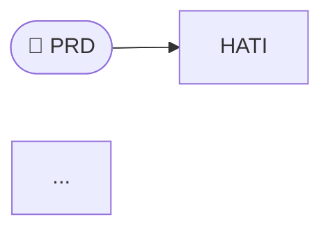

# Ragnarok — Evaluación Profesional Completa

**Versión analizada:** v2.2.4  
**Fecha de evaluación:** 2026-03-28  
**Alcance:** Instalador · Distribución · Arquitectura · DevOps · Documentación · Multi-IDE · Calidad de código

---

## Resumen Ejecutivo

Ragnarok tiene una **propuesta de valor sólida y diferenciada**: un ecosistema de cuatro módulos MCP (HATI, SKOLL, FENRIR, TYR) que cubren planning, orquestación, memoria y calidad en un solo binario. La lógica de negocio existe y tiene profundidad real.

El problema es que **todo lo que rodea al código fuente** — cómo se distribuye, cómo se instala, cómo se configura, cómo se documenta, cómo se libera — está en estado de prototipo personal. Hay 17 releases publicados en un mismo día, ninguno contiene binarios compilados, el instalador rápido descarga de un repo que no existe, y el archivo de configuración de OpenCode tiene hardcodeado el path de la máquina del autor.

Este documento cataloga cada problema, su impacto real y la solución concreta.

---

## Tabla de Severidad

| # | Área | Problema | Severidad |
|---|------|----------|-----------|
| 01 | Distribución | Releases sin binarios compilados | 🔴 CRÍTICO |
| 02 | Instalador | `install_quick.ps1` URL rota (org inexistente) | 🔴 CRÍTICO |
| 03 | Instalador | Paradigma build-from-source requiere Go instalado | 🔴 CRÍTICO |
| 04 | Configuración | `opencode.json` con path personal hardcodeado en repo | 🔴 CRÍTICO |
| 05 | CI/CD | Sin GitHub Actions — ningún workflow | 🔴 CRÍTICO |
| 06 | Instalador | Detección `irm\|iex` usa `$PSCommandPath` null | 🔴 CRÍTICO |
| 07 | Multi-IDE | Solo OpenCode configurado, Claude Code/Cursor/Windsurf ignorados | 🟠 ALTO |
| 08 | Releases | 17 releases en un día — proceso de release manual y frágil | 🟠 ALTO |
| 09 | API | Breaking changes masivos (59 funciones eliminadas) sin deprecation | 🟠 ALTO |
| 10 | Testing | Tests solo de schema, no de comportamiento end-to-end | 🟠 ALTO |
| 11 | Documentación | AGENTS.md mínimo, generado por v1.2.0 cuando el proyecto está en v2.2.4 | 🟡 MEDIO |
| 12 | Documentación | README con diagramas Mermaid que no renderizan | 🟡 MEDIO |
| 13 | Instalador | Versión hardcodeada, no auto-detecta latest | 🟡 MEDIO |
| 14 | Proyecto Go | `go.work` sobrante sin workspace real | 🟡 MEDIO |
| 15 | Proyecto Go | Nombre de módulo con capital R no convencional | 🟡 MEDIO |
| 16 | Repo | Directorios de runtime (`.ragnarok/`, `.skoll/`, `.tyr/`) en fuente | 🟡 MEDIO |
| 17 | Makefile | Versión stale (`v1.4.0`), paths inconsistentes, sin cross-compile | 🟡 MEDIO |
| 18 | Linux/macOS | Sin `install.sh` — ecosistema excluye plataformas principales | 🟡 MEDIO |
| 19 | Repo | Changelog incompleto entre v2.1.0 y v2.2.4 en README | 🟢 BAJO |
| 20 | Documentación | Sin `CONTRIBUTING.md` ni guía de desarrollo local | 🟢 BAJO |

---

## 01 — Releases sin binarios compilados

### Estado actual

Los 17 releases de Ragnarok tienen exactamente 3 assets cada uno: `Source code (zip)`, `Source code (tar.gz)`, y en algunos casos un `rag.exe` subido manualmente de forma inconsistente. El release v2.2.4 dice explícitamente "Or download rag.exe directly from this release" pero ese asset puede o no estar presente dependiendo de si fue subido a mano.

```
Assets (3):
  ├── Source code (zip)      ← auto-generado por GitHub
  ├── Source code (tar.gz)   ← auto-generado por GitHub
  └── [rag.exe]              ← subido manualmente, no siempre presente
```

Esto significa que ningún usuario puede instalar el binario directamente. El instalador compensa compilando desde fuente, lo cual introduce la dependencia transitiva en Go.

### Cómo debe ser

Cada release debe tener binarios precompilados para todas las plataformas objetivo, generados automáticamente por GoReleaser en CI:

```
Assets (12):
  ├── ragnarok_2.2.4_windows_amd64.zip
  ├── ragnarok_2.2.4_linux_amd64.tar.gz
  ├── ragnarok_2.2.4_linux_arm64.tar.gz
  ├── ragnarok_2.2.4_darwin_amd64.tar.gz
  ├── ragnarok_2.2.4_darwin_arm64.tar.gz
  ├── checksums.txt                        ← SHA256 de todos los archivos
  └── Source code (zip/tar.gz)             ← auto-generado
```

### Solución: `.goreleaser.yaml`

```yaml
version: 2
project_name: ragnarok

before:
  hooks:
    - go mod tidy

builds:
  - id: rag
    main: ./cmd/rag
    binary: rag
    ldflags:
      - -s -w
      - -X main.version={{.Version}}
      - -X main.buildDate={{.Date}}
      - -X main.commit={{.Commit}}
    env:
      - CGO_ENABLED=0
    goos: [linux, darwin, windows]
    goarch: [amd64, arm64]
    ignore:
      - goos: windows
        goarch: arm64

archives:
  - id: rag
    builds: [rag]
    name_template: "ragnarok_{{ .Version }}_{{ .Os }}_{{ .Arch }}"
    format_overrides:
      - goos: windows
        format: zip

checksum:
  name_template: "checksums.txt"
  algorithm: sha256

changelog:
  sort: asc
  filters:
    exclude:
      - "^docs:"
      - "^test:"

release:
  github:
    owner: andragon31
    name: Ragnarok
  name_template: "Ragnarok v{{ .Version }}"
```

---

## 02 — `install_quick.ps1` URL rota

### Estado actual

```powershell
# install_quick.ps1 — línea 6, URL completamente rota:
$url = "https://raw.githubusercontent.com/ragnarok-ecosystem/ragnarok/main/install.ps1"
```

La organización `ragnarok-ecosystem` no existe en GitHub. Cualquier usuario que use el one-liner recomendado obtiene un error HTTP 404 inmediato. Es la primera experiencia de usuario y está rota.

### Cómo debe ser

```powershell
# install_quick.ps1 — corregido y mejorado
param([string]$Version = "")

$REPO = "andragon31/Ragnarok"

if ($Version -eq "") {
    $rel     = Invoke-RestMethod "https://api.github.com/repos/$REPO/releases/latest"
    $VERSION = $rel.tag_name.TrimStart("v")
} else {
    $VERSION = $Version
}

$url       = "https://raw.githubusercontent.com/$REPO/v$VERSION/install.ps1"
$tmpScript = Join-Path $env:TEMP "ragnarok_install_$(Get-Random).ps1"

try {
    Invoke-WebRequest -Uri $url -OutFile $tmpScript -UseBasicParsing
    & $tmpScript -Version $VERSION @args
} finally {
    Remove-Item $tmpScript -ErrorAction SilentlyContinue
}
```

---

## 03 — Paradigma de instalación incorrecto (build-from-source)

### Estado actual

```
Flujo actual de install.ps1:
  verifica Go ← BARRERA para usuario final
  verifica Git
  git clone repo
  go build ./cmd/rag
  copia binario
  elimina clone
```

El instalador convierte al usuario en un compilador de Go. Requiere que el usuario final tenga instalado Go, Git, y suficiente tiempo para que el build descargue dependencias. Esto es aceptable para un entorno de desarrollo, no para un tool de producción distribuido.

### Cómo debe ser

```
Flujo correcto (paradigma engram/goreleaser):
  detecta OS y arch
  obtiene latest version de GitHub API
  descarga binario precompilado (.zip o .tar.gz)
  verifica SHA256 checksum
  extrae e instala
  agrega al PATH
  ejecuta rag setup <ide>
```

El usuario no necesita Go, no necesita Git, no necesita compilar nada.

```powershell
# install.ps1 — paradigma correcto

param(
    [string]$InstallDir = "$env:LOCALAPPDATA\Ragnarok",
    [string]$Version    = ""
)

$REPO = "andragon31/Ragnarok"

function Write-Step($msg) { Write-Host "`n[STEP] $msg" -ForegroundColor Cyan }
function Write-OK($msg)   { Write-Host "[ OK ] $msg" -ForegroundColor Green }
function Write-Warn($msg) { Write-Host "[WARN] $msg" -ForegroundColor Yellow }
function Write-Err($msg)  { Write-Host "[ERR ] $msg" -ForegroundColor Red; exit 1 }

# 1. Detectar versión
Write-Step "Detecting latest version..."
if ($Version -eq "") {
    try {
        $rel     = Invoke-RestMethod "https://api.github.com/repos/$REPO/releases/latest"
        $VERSION = $rel.tag_name.TrimStart("v")
        Write-OK "Latest: v$VERSION"
    } catch {
        Write-Err "Could not fetch latest version. Use -Version x.x.x to specify manually."
    }
} else {
    $VERSION = $Version
}

# 2. Detectar arquitectura
$ARCH   = if ([Environment]::Is64BitOperatingSystem) { "amd64" } else { "386" }
$ASSET  = "ragnarok_${VERSION}_windows_${ARCH}.zip"
$DL_URL = "https://github.com/$REPO/releases/download/v$VERSION/$ASSET"
$CS_URL = "https://github.com/$REPO/releases/download/v$VERSION/checksums.txt"

# 3. Descargar
Write-Step "Downloading $ASSET..."
$zipPath = Join-Path $env:TEMP $ASSET
try {
    Invoke-WebRequest -Uri $DL_URL -OutFile $zipPath -UseBasicParsing
    Write-OK "Downloaded"
} catch {
    Write-Err "Download failed: $_"
}

# 4. Verificar checksum
Write-Step "Verifying checksum..."
try {
    $csText   = (Invoke-WebRequest -Uri $CS_URL -UseBasicParsing).Content
    $expected = ($csText -split "`n" | Where-Object { $_ -match $ASSET }) -split "\s+" | Select-Object -First 1
    $actual   = (Get-FileHash $zipPath -Algorithm SHA256).Hash.ToLower()
    if ($actual -ne $expected.ToLower()) { Write-Err "Checksum mismatch." }
    Write-OK "Checksum valid"
} catch {
    Write-Warn "Could not verify checksum (continuing)"
}

# 5. Instalar
Write-Step "Installing to $InstallDir..."
New-Item -ItemType Directory -Path $InstallDir -Force | Out-Null
Expand-Archive -Path $zipPath -DestinationPath $InstallDir -Force
Remove-Item $zipPath
Write-OK "Extracted to $InstallDir"

# 6. PATH
$userPath = [Environment]::GetEnvironmentVariable('PATH', 'User')
if ($userPath -notlike "*$InstallDir*") {
    [Environment]::SetEnvironmentVariable('PATH', "$userPath;$InstallDir", 'User')
    $env:PATH = "$env:PATH;$InstallDir"
    Write-OK "Added to PATH"
}

# 7. Setup IDE
$ragBin = Join-Path $InstallDir "rag.exe"
Write-Step "Configuring IDE integrations..."
& $ragBin setup all 2>&1 | ForEach-Object { Write-Host "  $_" -ForegroundColor Gray }

Write-Host "`n  Ragnarok v$VERSION installed successfully." -ForegroundColor Green
Write-Host "  Run 'rag --help' to get started.`n" -ForegroundColor White
```

---

## 04 — `opencode.json` con path personal hardcodeado

### Estado actual

```json
{
  "$schema": "https://opencode.ai/config.json",
  "mcp": {
    "ragnarok": {
      "type": "local",
      "command": ["C:/Users/Andragon/AppData/Local/Ragnarok/bin/rag.exe", "mcp"],
      "enabled": true
    }
  }
}
```

Este archivo está **commiteado en el repositorio público** con el path absoluto de la máquina personal del autor. Cualquier desarrollador que clone el repo tiene un `opencode.json` que apunta a una ruta que no existe en su máquina. El comando `rag setup opencode` debería sobrescribir esto, pero la existencia de este archivo en el repo genera confusión y puede bloquear a usuarios que no corran `setup` primero.

### Cómo debe ser

El `opencode.json` no debe estar en el repo o debe usar una ruta relativa/dinámica:

```json
{
  "$schema": "https://opencode.ai/config.json",
  "mcp": {
    "ragnarok": {
      "type": "local",
      "command": ["rag", "mcp"],
      "enabled": true
    }
  }
}
```

Usando solo `"rag"` como comando, OpenCode resuelve el ejecutable via `$PATH` — lo cual es correcto si `install.ps1` hizo su trabajo. El archivo puede quedarse en el repo como **template de ejemplo** pero debe documentarse que `rag setup opencode` lo escribe en la ruta correcta (`~/.config/opencode/opencode.json` o `.mcp.json` del proyecto).

Adicionalmente, agregar al `.gitignore`:

```gitignore
# Configuraciones locales generadas por rag setup
.mcp.json
.cursor/mcp.json
.claude/settings.local.json
```

---

## 05 — Sin GitHub Actions (CI/CD ausente)

### Estado actual

La pestaña de Actions del repositorio muestra la página de "Get started" — no existe ningún workflow configurado. Esto implica:

- No hay validación automática de que el código compila en PR.
- No hay ejecución automática de tests al pushear.
- Los 17 releases se crearon manualmente, incluyendo subir `rag.exe` a mano en algunos.
- No es posible implementar GoReleaser automático sin esto.
- Un bug puede llegar a `main` sin ninguna red de seguridad.

El patrón de 17 releases en un día con múltiples bug fixes críticos (thread safety, nil pointers, funciones stub) indica que el ciclo de feedback fue: "compile localmente → push → test manualmente → encontrar bug → fixear → nuevo release". Con CI/CD, la mitad de esos releases no habrían existido.

### Cómo debe ser

**`.github/workflows/ci.yml`** — Ejecutar en cada push y PR:

```yaml
name: CI

on:
  push:
    branches: [main]
  pull_request:
    branches: [main]

jobs:
  test:
    strategy:
      matrix:
        os: [ubuntu-latest, windows-latest, macos-latest]
        go: ["1.22"]
    runs-on: ${{ matrix.os }}
    steps:
      - uses: actions/checkout@v4

      - uses: actions/setup-go@v5
        with:
          go-version: ${{ matrix.go }}
          cache: true

      - name: Verify module
        run: go mod verify

      - name: Build
        run: go build -v ./cmd/rag

      - name: Vet
        run: go vet ./...

      - name: Test
        run: go test -race -coverprofile=coverage.txt ./...

      - name: Upload coverage
        uses: codecov/codecov-action@v4
        if: matrix.os == 'ubuntu-latest'
        with:
          file: coverage.txt
```

**`.github/workflows/release.yml`** — Ejecutar solo al crear un tag `v*`:

```yaml
name: Release

on:
  push:
    tags: ["v*"]

permissions:
  contents: write

jobs:
  release:
    runs-on: ubuntu-latest
    steps:
      - uses: actions/checkout@v4
        with:
          fetch-depth: 0

      - uses: actions/setup-go@v5
        with:
          go-version: "1.22"
          cache: true

      - name: Run tests before release
        run: go test ./...

      - name: Run GoReleaser
        uses: goreleaser/goreleaser-action@v6
        with:
          version: latest
          args: release --clean
        env:
          GITHUB_TOKEN: ${{ secrets.GITHUB_TOKEN }}
```

Con estos dos workflows, el proceso de release se convierte en:

```bash
git tag v2.3.0
git push --tags
# GitHub Actions compila, testea, y publica en ~3 minutos
```

---

## 06 — Detección `irm|iex` usa `$PSCommandPath` null

### Estado actual

```powershell
# install.ps1 — bloque que nunca funciona (líneas 19–28):
if ($MyInvocation.InvocationName -eq "iex") {
    $content = Get-Content $PSCommandPath -Raw  # PSCommandPath es NULL en irm|iex
    $content | Set-Content $scriptPath ...
    & $scriptPath ...
    exit
}
```

Cuando PowerShell ejecuta código via `irm url | iex`, el script no tiene presencia en disco. `$PSCommandPath` es `$null` y `$MyInvocation.InvocationName` es `"<ScriptBlock>"`, no `"iex"`. El bloque entero nunca se activa bajo ninguna condición real.

### Cómo debe ser

Con el paradigma de descarga de binario precompilado (punto 03), este bloque ya no existe. El script no necesita clonar nada ni ejecutarse como archivo — solo descarga, verifica y extrae. Eliminar el bloque por completo.

---

## 07 — Multi-IDE: solo OpenCode configurado

### Estado actual

`rag setup` solo configura OpenCode. El ecosistema no tiene integración automática con:
- **Claude Code** (`.claude/settings.json`)
- **Cursor** (`.cursor/mcp.json`)
- **Windsurf** (`~/.windsurf/mcp.json`)
- **Gemini CLI** (`~/.gemini/settings.json`)

Dado que Ragnarok se publicita como un ecosistema agente universal, la ausencia de estos setups es una limitación significativa. Un usuario de Claude Code tiene que configurarlo manualmente buscando la documentación (que no existe).

### Cómo debe ser

El comando `rag setup` debe soportar todos los IDEs relevantes:

```
rag setup opencode    # Ya existe
rag setup claude      # Escribe ~/.claude/settings.json
rag setup cursor      # Escribe .cursor/mcp.json en el proyecto
rag setup windsurf    # Escribe ~/.windsurf/mcp.json
rag setup gemini      # Escribe ~/.gemini/settings.json
rag setup all         # Configura todos los detectados
```

**Configuración para Claude Code** (`~/.claude/settings.json`):

```json
{
  "mcpServers": {
    "ragnarok": {
      "command": "rag",
      "args": ["mcp"]
    }
  }
}
```

**Configuración para Cursor** (`.cursor/mcp.json`):

```json
{
  "mcpServers": {
    "ragnarok": {
      "command": "rag",
      "args": ["mcp"]
    }
  }
}
```

**Configuración para Windsurf** (`~/.windsurf/mcp.json`):

```json
{
  "mcpServers": {
    "ragnarok": {
      "command": "rag",
      "args": ["mcp"]
    }
  }
}
```

La implementación de `rag setup all` debe: detectar qué IDEs están instalados en la máquina, escribir solo las configs de los IDEs detectados, e imprimir un resumen de qué configuró y qué no detectó.

Adicionalmente, incluir instrucciones en el README para cada IDE, con el snippet de config copiable (como hace engram en su sección "Agent Setup").

---

## 08 — 17 Releases en un día: proceso de release frágil

### Estado actual

```
v2.0.1  28 Mar ~03:00
v2.0.2  28 Mar ~04:20
v2.0.3  28 Mar ~05:06
v2.0.4  28 Mar ~05:41
v2.0.5  28 Mar ~05:46
v2.0.6  28 Mar ~06:01
v2.1.0  28 Mar ~06:58
v2.2.0  28 Mar ~07:40
v2.2.2  28 Mar ~08:10
v2.2.3  29 Mar ~00:02
v2.2.4  29 Mar ~01:00
```

Múltiples versiones con bug fixes críticos (nil pointers, thread safety, funciones stub) publicadas en iteraciones de minutos. Esto es señal de que el ciclo de validación es puramente manual: compilar localmente, usar, encontrar bug, arreglar, publicar.

Cada uno de estos bugs habría sido detectado con:
- Un CI que corra `go test -race ./...` en cada push.
- Tests de integración básicos que ejerciten los flujos principales.
- Un proceso de release que requiera que los tests pasen antes de crear el tag.

### Cómo debe ser

El proceso de release debería tener fricción intencional:

```
desarrollo → PR → CI (tests deben pasar) → merge a main
                                               ↓
                                    cuando está listo:
                                    git tag v2.3.0
                                    git push --tags
                                    GitHub Actions: test → build → release
```

La regla práctica: **no crear un tag de release mientras haya un bug conocido sin test que lo cubra**.

---

## 09 — Breaking changes sin deprecation

### Estado actual

En v2.1.0 se eliminaron 59 funciones MCP en un solo release sin periodo de deprecation:

```
Funciones eliminadas en un solo commit:
  Hati:   27 funciones (plan_lock, checkpoint_*, feedback_*, notification_ack, ...)
  Fenrir:  9 funciones (bias_report, intent_*, incident_*, conflict_*)
  Skoll:  17 funciones (workflow_*, task_*, rule_pending, ...)
  Tyr:     6 funciones (audit_log, inject_guard, proactive_scan, ...)
```

Cualquier agente o integración construida sobre versiones anteriores de Ragnarok que llame a estas funciones recibirá un error de "tool not found" sin ningún mensaje explicativo. Desde la perspectiva de un agente usando MCP, desaparecen herramientas silenciosamente.

### Cómo debe ser

Para una API pública (MCP tools = API pública porque los agentes la consumen), el proceso correcto es:

**Paso 1 — Ciclo de deprecation:** Marcar las funciones como deprecated en la respuesta MCP con un mensaje claro:

```json
{
  "deprecated": true,
  "deprecation_message": "plan_lock está deprecated desde v2.1.0. Use plan_update con status='locked'. Se eliminará en v3.0.0.",
  "result": "..."
}
```

**Paso 2 — Mantener la función un ciclo de versión minor** (e.g., todo v2.x.x) retornando un warning.

**Paso 3 — Eliminar en major version bump** (v3.0.0).

**Paso 4 — Documentar en CHANGELOG con guía de migración:**

```markdown
## v2.1.0 — Migration Guide

### Funciones eliminadas y sus reemplazos

| Eliminada | Reemplazo |
|-----------|-----------|
| `plan_lock` | `plan_update` con `status: "locked"` |
| `checkpoint_decide` | `checkpoint_approve` |
| `workflow_start` | `rag continue --plan <id>` |
```

---

## 10 — Testing insuficiente: schema sin comportamiento

### Estado actual

Los tests existentes validan que las tablas de base de datos tienen las columnas correctas (schema validation). Son útiles pero solo cubren una capa muy estrecha:

```go
// Ejemplo del patrón de test actual:
func TestHatiSchemaValidation(t *testing.T) {
    // Verifica que existen 17 tablas
    // Verifica columnas de cada tabla
    // NO prueba que plan_create realmente crea un plan
    // NO prueba que task_get_next devuelve la tarea correcta
    // NO prueba que checkpoint_approve actualiza el estado
}
```

Los bugs encontrados en producción (multi-digit phase numbers, nil pointers en GeneratePhasesAndTasks, path inconsistencies, funciones stub retornando zeros) no son detectables con tests de schema.

### Cómo debe ser

Los tests deben cubrir **comportamiento**, no solo estructura. Cada handler MCP debería tener al menos un test de integración que verifique el flujo completo:

```go
// Ejemplo de test de comportamiento:
func TestPlanCreateAndRetrieve(t *testing.T) {
    db := setupTestDB(t)
    h  := NewHati(db)
    
    // Crear un plan
    result, err := h.HandlePlanCreate(map[string]any{
        "name":        "Test Project",
        "description": "A test plan",
        "stack":       "go",
    })
    require.NoError(t, err)
    planID := result["id"].(string)
    
    // Recuperarlo
    plan, err := h.HandlePlanGet(map[string]any{"plan_id": planID})
    require.NoError(t, err)
    assert.Equal(t, "Test Project", plan["name"])
    assert.Equal(t, "pending", plan["status"])
}

func TestMultiDigitPhaseNumbers(t *testing.T) {
    // Regresión del bug v2.0.3
    db := setupTestDB(t)
    h  := NewHati(db)
    
    // Crear más de 9 fases (el bug rompía en phase >= 10)
    planID := createTestPlan(t, h)
    for i := 0; i < 12; i++ {
        _, err := h.HandlePhaseCreate(map[string]any{
            "plan_id": planID,
            "name":    fmt.Sprintf("Phase %d", i+1),
        })
        require.NoError(t, err, "phase %d creation failed", i+1)
    }
    
    phases, err := h.HandlePhaseList(map[string]any{"plan_id": planID})
    require.NoError(t, err)
    assert.Len(t, phases, 12)
}
```

Una cobertura mínima profesional para un proyecto de esta complejidad es 60-70% de las rutas críticas, con especial énfasis en flujos que han tenido bugs previamente.

---

## 11 — AGENTS.md mínimo y desactualizado

### Estado actual

```markdown
# Ragnarok - Agent Guidelines
> Auto-generated by Fenrir v1.2.0 on project scan

## Project Stack
* **Language**: go
* **Architecture**: monolith

## Modules
* `.` (go)
```

Este archivo tiene dos problemas. Primero, fue generado por Fenrir v1.2.0 cuando el proyecto está en v2.2.4 — significa que nunca fue actualizado después del scan inicial. Segundo, no contiene ninguna información útil para un agente que trabaje sobre el proyecto: no describe la arquitectura de módulos, no explica dónde están los archivos importantes, no tiene convenciones de código, ni guías de cómo contribuir o debuggear.

Para un proyecto cuya propuesta de valor es mejorar el trabajo de agentes IA, el propio `AGENTS.md` debería ser un ejemplo excepcional de cómo se escribe bien.

### Cómo debe ser

```markdown
# Ragnarok — Agent Guidelines
> v2.2.4 | Actualizar con cada cambio arquitectónico significativo

## Propósito del Proyecto

Ragnarok es un ecosistema MCP de 4 módulos para orquestar agentes IA en desarrollo de software.
Un único binario (`rag`) expone todos los módulos via MCP stdio.

## Estructura de Módulos

```
internal/
  fenrir/     # Memoria: FTS5, sessions, specs, graph context
  hati/       # Planning: plans, phases, tasks, human-in-the-loop
  skoll/      # Orquestación: agentes, skills, rules, teams
  tyr/        # Calidad: SAST, pkg vetting, standards, pre-commit
cmd/rag/      # CLI + MCP entrypoint
internal/mcp/ # Unified MCP server (despacha a los 4 módulos)
```

## Base de Datos

Cada módulo tiene su propia base SQLite:
- `~/.ragnarok/fenrir.db`
- `~/.ragnarok/hati.db`
- `~/.ragnarok/skoll.db`
- `~/.ragnarok/tyr.db`

## Convenciones de Código

- Todos los handlers MCP reciben `map[string]any` y retornan `(map[string]any, error)`
- IDs se generan con `generateID()` (thread-safe con sync.Mutex)
- Todas las DBs tienen `PRAGMA foreign_keys = ON` y `PRAGMA journal_mode = WAL`
- Los handlers tienen timeout de 30s
- Tests en `internal/<modulo>/database/` siguen el patrón `TestXxx_Behavior`

## Flujo de Trabajo Principal

```
PRD.md → rag project --prd PRD.md → plan_id
plan_id → rag new / rag continue → ciclo de desarrollo
ciclo → rag review → checkpoint + validación humana
```

## Comandos de Diagnóstico

```bash
rag doctor          # Health check completo
rag status          # Estado del ecosistema
rag cleanup         # Limpiar WAL/SHM
rag version         # Versión de todos los módulos
```
```

---

## 12 — README con diagramas Mermaid sin renderizar

### Estado actual

El README contiene diagramas Mermaid dentro de bloques de código sin la directiva correcta:

````
```
graph LR
    PRD([📄 PRD]) --> HATI
    ...
```
````

GitHub renderiza Mermaid solo cuando el bloque tiene la etiqueta `mermaid` explícita. Sin ella, el usuario ve texto plano. Los diagramas son la parte más visual del README y no funcionan.

### Cómo debe ser

````

````

Además, el README debería incluir una sección de "Quick Start" real con el one-liner de instalación correcto, antes de los diagramas de arquitectura.

---

## 13 — Versión hardcodeada en instalador

### Estado actual

```powershell
$VERSION = "2.2.4"  # Se desactualiza con cada release
```

### Cómo debe ser

```powershell
# Auto-detect desde GitHub API, fallback si falla:
try {
    $rel     = Invoke-RestMethod "https://api.github.com/repos/andragon31/Ragnarok/releases/latest"
    $VERSION = $rel.tag_name.TrimStart("v")
} catch {
    $VERSION = "2.2.4"  # fallback
    Write-Warn "Using fallback version $VERSION"
}
```

---

## 14 — `go.work` sobrante

### Estado actual

El archivo `go.work` en la raíz indica un Go workspace multi-módulo, pero solo existe un `go.mod`. El `go.work` sobrante puede interferir con `go build`, `go test`, `gopls`, y herramientas de análisis externas.

### Cómo debe ser

```bash
# Verificar si causa problemas:
go work sync  # si falla → inconsistente

# Si no hay sub-módulos reales, eliminar:
rm go.work go.work.sum
```

Si en el futuro se separan los módulos (e.g., `internal/fenrir` como módulo independiente), recrearlo en ese momento.

---

## 15 — Nombre de módulo Go con capital

### Estado actual

```go
module github.com/andragon31/Ragnarok
```

### Cómo debe ser

```go
module github.com/andragon31/ragnarok
```

La convención de Go establece paths de módulo en lowercase. Si bien el compilador lo acepta, puede causar issues con `pkg.go.dev`, `golangci-lint`, y algunos proxies de módulos. Dado que el proyecto está en desarrollo activo y aún no tiene dependientes externos, el costo de migración es bajo.

---

## 16 — Directorios de runtime en el repositorio fuente

### Estado actual

```
Ragnarok/
├── .ragnarok/          ← datos runtime del ecosistema (commiteado)
├── .skoll/
│   └── skills/
│       └── go-testing/ ← skill de Skoll (commiteado como dato runtime)
└── .tyr/               ← datos de Tyr (commiteado)
```

Estos directorios son generados por la ejecución del ecosistema sobre el propio repo de desarrollo. Estar commiteados significa que un developer que clone el repo tiene datos de runtime del ambiente de otra persona mezclados con el código fuente.

### Cómo debe ser

```gitignore
# .gitignore — agregar:

# Datos de runtime de Ragnarok (generados por rag init / rag scan)
.ragnarok/
.tyr/

# Skoll runtime, excepto ejemplos de skills distribuibles
.skoll/
!.skoll/skills/
.skoll/skills/*/cache/
.skoll/skills/*/state/
```

Si `.skoll/skills/go-testing/` es un skill de ejemplo que debe distribuirse con el proyecto, moverlo a `examples/skills/go-testing/` para que sea explícitamente un recurso de documentación.

---

## 17 — Makefile inconsistente y desactualizado

### Estado actual

```makefile
# Tres problemas concretos:

# 1. Versión stale en el help
help:
    @echo "Ragnarok v1.4.0 ..."  # Proyecto está en v2.2.4

# 2. Extensión .exe hardcodeada con path Unix
RAG_BIN := $(BIN_DIR)/rag.exe
install:
    cp $(RAG_BIN) ~/.local/bin/  # cp no existe en Windows

# 3. Sin targets de cross-compilation ni release
```

### Cómo debe ser

```makefile
VERSION := $(shell git describe --tags --always --dirty 2>/dev/null || echo "dev")
LDFLAGS := -ldflags="-s -w -X main.version=$(VERSION)"

ifeq ($(OS),Windows_NT)
    BINARY     := bin/rag.exe
    INSTALL_DIR := $(LOCALAPPDATA)/Ragnarok
else
    BINARY     := bin/rag
    INSTALL_DIR := $(HOME)/.local/bin
endif

.PHONY: all build build-all test lint clean install release help

build:
	go build $(LDFLAGS) -o $(BINARY) ./cmd/rag

build-all:
	GOOS=linux   GOARCH=amd64 go build $(LDFLAGS) -o bin/rag_linux_amd64   ./cmd/rag
	GOOS=linux   GOARCH=arm64 go build $(LDFLAGS) -o bin/rag_linux_arm64   ./cmd/rag
	GOOS=darwin  GOARCH=amd64 go build $(LDFLAGS) -o bin/rag_darwin_amd64  ./cmd/rag
	GOOS=darwin  GOARCH=arm64 go build $(LDFLAGS) -o bin/rag_darwin_arm64  ./cmd/rag
	GOOS=windows GOARCH=amd64 go build $(LDFLAGS) -o bin/rag_windows.exe   ./cmd/rag

test:
	go test -race -coverprofile=coverage.out ./...
	go tool cover -func=coverage.out | tail -1

lint:
	go vet ./...

release:
	goreleaser release --clean

help:
	@echo "Ragnarok $(VERSION)"
	@echo ""
	@echo "  build      Build for current platform"
	@echo "  build-all  Cross-compile all platforms"
	@echo "  test       Run tests with race detector"
	@echo "  lint       Run go vet"
	@echo "  release    GoReleaser release"
```

---

## 18 — Sin soporte Linux/macOS

### Estado actual

`install.ps1` rechaza cualquier OS que no sea Windows. No existe `install.sh`.

Dado que Ragnarok trabaja con Claude Code, Cursor, y Windsurf — tools con fuerte adopción en Linux y macOS — la ausencia del script de instalación excluye una porción significativa del público objetivo.

### Cómo debe ser

```bash
#!/usr/bin/env bash
# install.sh — instalador para Linux y macOS
set -euo pipefail

REPO="andragon31/Ragnarok"
INSTALL_DIR="${INSTALL_DIR:-$HOME/.local/bin}"

# Detectar OS y arch
OS=$(uname -s | tr '[:upper:]' '[:lower:]')
ARCH=$(uname -m)
case $ARCH in
  x86_64)          ARCH="amd64" ;;
  aarch64 | arm64) ARCH="arm64" ;;
  *)  echo "Unsupported arch: $ARCH" && exit 1 ;;
esac

# Obtener versión latest
VERSION=$(curl -fsSL "https://api.github.com/repos/$REPO/releases/latest" \
  | grep '"tag_name"' | sed 's/.*"v\([^"]*\)".*/\1/')

ASSET="ragnarok_${VERSION}_${OS}_${ARCH}.tar.gz"
DL_URL="https://github.com/$REPO/releases/download/v${VERSION}/$ASSET"
TMP=$(mktemp -d)

echo "Installing Ragnarok v$VERSION ($OS/$ARCH)..."

# Descargar y verificar
curl -fsSL "$DL_URL" -o "$TMP/$ASSET"
curl -fsSL "https://github.com/$REPO/releases/download/v${VERSION}/checksums.txt" \
  | grep "$ASSET" | sha256sum --check --status

# Instalar
mkdir -p "$INSTALL_DIR"
tar -xzf "$TMP/$ASSET" -C "$TMP"
mv "$TMP/rag" "$INSTALL_DIR/rag"
chmod +x "$INSTALL_DIR/rag"
rm -rf "$TMP"

# Configurar PATH si hace falta
if [[ ":$PATH:" != *":$INSTALL_DIR:"* ]]; then
  echo ""
  echo "Add to your shell profile:"
  echo "  export PATH=\"\$PATH:$INSTALL_DIR\""
fi

echo "Done. Run 'rag --help' to get started."
```

---

## Plan de Acción Consolidado

### Fase 1 — Bugs bloqueantes (resolver antes del próximo release público)

| Tarea | Archivo | Tiempo est. |
|-------|---------|-------------|
| Corregir URL en `install_quick.ps1` | `install_quick.ps1` | 5 min |
| Crear `.goreleaser.yaml` | nuevo | 30 min |
| Crear `.github/workflows/release.yml` | nuevo | 20 min |
| Crear `.github/workflows/ci.yml` | nuevo | 20 min |
| Reescribir `install.ps1` (paradigma binary download) | `install.ps1` | 1h |
| Corregir `opencode.json` (usar `"rag"` en lugar de path absoluto) | `opencode.json` | 5 min |

### Fase 2 — Calidad y profesionalismo

| Tarea | Archivo | Tiempo est. |
|-------|---------|-------------|
| Crear `install.sh` para Linux/macOS | nuevo | 45 min |
| Implementar `rag setup claude/cursor/windsurf/gemini` | `internal/` | 2h |
| Agregar tests de comportamiento (no solo schema) | `internal/*/database/` | 4h |
| Reescribir `AGENTS.md` con contexto real del proyecto | `AGENTS.md` | 1h |
| Corregir diagramas Mermaid en README | `README.md` | 15 min |
| Reescribir Makefile con versión dinámica y cross-compile | `Makefile` | 30 min |

### Fase 3 — Deuda técnica

| Tarea | Archivo | Tiempo est. |
|-------|---------|-------------|
| Evaluar y eliminar `go.work` | `go.work` | 15 min |
| Evaluar renombrar módulo a lowercase | `go.mod` | 30 min |
| Agregar runtime dirs a `.gitignore` | `.gitignore` | 5 min |
| Crear `CONTRIBUTING.md` | nuevo | 1h |
| Documentar guía de migración de v2.0.x → v2.1.x+ | `CHANGELOG.md` | 1h |
| Agregar auto-detect de versión al instalador | `install.ps1` | 30 min |

---

## Estado Actual vs Estado Objetivo

| Dimensión | Hoy | Objetivo |
|-----------|-----|----------|
| **Instalación** | Requiere Go + Git + compilar | One-liner, cero dependencias |
| **Binarios** | Solo código fuente en releases | 5 plataformas + checksums automatizados |
| **CI/CD** | Ningún workflow | Build/test en PR + release automático en tag |
| **Multi-IDE** | Solo OpenCode | OpenCode, Claude Code, Cursor, Windsurf, Gemini CLI |
| **Tests** | Schema validation | Comportamiento, integración, regresiones |
| **AGENTS.md** | 12 líneas automáticas | Guía completa del proyecto para agentes |
| **README** | Diagramas rotos, instrucciones desactualizadas | Diagramas funcionales, Quick Start real |
| **Proceso de release** | Manual, frágil, ~17 releases en un día | Automatizado, con gates de calidad |
| **API stability** | Breaking changes sin aviso | Deprecation cycle documentado |

---

*Evaluación basada en el análisis del repositorio público [andragon31/Ragnarok](https://github.com/andragon31/Ragnarok) v2.2.4, el historial de releases, y comparación con las prácticas del ecosistema Go para distribución de herramientas.*
