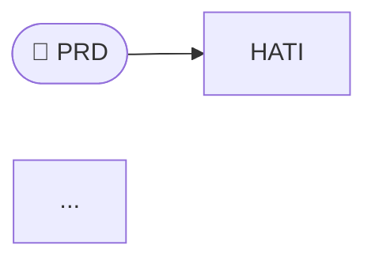

# Ragnarok — Mejoras Pendientes para Nivel Profesional

**Estado analizado:** `main` · v2.2.4  
**Fecha:** 2026-03-28  
**Tipo de análisis:** Fresh read de cada archivo actual + comparación contra evaluaciones anteriores

---

## Qué cambió desde las evaluaciones anteriores

Antes de listar los pendientes, el registro honesto de lo que sí se resolvió y lo que no:

| Punto | Estado anterior | Estado actual |
|-------|----------------|---------------|
| `.gitignore` sin runtime dirs | ❌ Faltaban | ✅ Corregido (`.ragnarok/`, `.skoll/`, `.tyr/`, `.fenrir/`) |
| Todos los demás puntos críticos | ❌ | ❌ Sin cambios |

El `.gitignore` se actualizó correctamente, pero los directorios ya commiteados **siguen tracked en git** (aparecen en el root del repo) — se necesita un paso adicional. El resto de los problemas críticos permanece intacto.

---

## Problemas actuales — Inventario completo

### 🔴 CRÍTICO-1 · `verify_install.ps1` verifica una arquitectura que no existe

**Este es el problema más grave encontrado en esta revisión.** Es un archivo nuevo que no estaba en evaluaciones anteriores.

#### Estado actual

```powershell
# verify_install.ps1 — líneas 24-28:
$binaries = @("fenrir.exe", "hati.exe", "skoll.exe", "tyr.exe", "rag.exe")
foreach ($bin in $binaries) {
    $binPath = Join-Path $binDir $bin
    ...
}
```

El script verifica la existencia de cuatro binarios separados: `fenrir.exe`, `hati.exe`, `skoll.exe`, `tyr.exe`. Pero Ragnarok desde v2.x es un **único binario unificado** (`rag.exe`). Esos cuatro ejecutables no existen ni se generan. Cualquier usuario que corra `verify_install.ps1` ve 4 FAIL inmediatamente aunque la instalación sea perfecta.

El mismo script también busca servidores MCP individuales en `.mcp.json`:
```powershell
foreach ($server in @("fenrir", "hati", "skoll", "tyr")) { ... }
```
Pero el servidor MCP unificado se registra como `"ragnarok"`, no como cuatro entradas separadas.

Y verifica directorios de datos en la ruta equivocada:
```powershell
$dataDir = Join-Path $InstallDir "data"          # busca en $LOCALAPPDATA\Ragnarok\data\
# ...pero según v2.2.3 los datos están en:        ~/.ragnarok/.fenrir  etc.
```

Además el header del script muestra `"Ragnarok v1.2.0"` cuando el proyecto está en v2.2.4.

En resumen: **`verify_install.ps1` siempre falla** aunque la instalación sea perfecta, porque verifica la arquitectura pre-unificación.

#### Cómo debe ser

```powershell
# verify_install.ps1 — reescrito para arquitectura unificada

param(
    [string]$InstallDir = "$env:LOCALAPPDATA\Ragnarok",
    [switch]$Verbose
)

$passed = 0
$failed = 0

function Pass($name) { Write-Host "[PASS] $name" -ForegroundColor Green;  $script:passed++ }
function Fail($name, $reason) { Write-Host "[FAIL] $name — $reason" -ForegroundColor Red; $script:failed++ }

Write-Host "Ragnarok v2.2.4 — Installation Verification`n" -ForegroundColor Cyan

# 1. Binario unificado
$ragBin = Join-Path $InstallDir "rag.exe"
if (Test-Path $ragBin) {
    Pass "rag.exe exists ($ragBin)"
    
    # Responde a version
    $ver = & $ragBin version 2>&1
    if ($LASTEXITCODE -eq 0) { Pass "rag version: $ver" } else { Fail "rag version" "exit code $LASTEXITCODE" }
    
    # Responde a doctor
    $doc = & $ragBin doctor 2>&1
    if ($LASTEXITCODE -eq 0) { Pass "rag doctor passed" } else { Fail "rag doctor" ($doc | Select-Object -First 3) }
    
    # MCP responde en stdio
    $mcp = echo '{"jsonrpc":"2.0","method":"initialize","id":1,"params":{"protocolVersion":"2024-11-05","capabilities":{},"clientInfo":{"name":"verify","version":"1"}}}' | & $ragBin mcp 2>$null | Select-Object -First 1
    if ($mcp -match '"result"') { Pass "MCP stdio responds" } else { Fail "MCP stdio" "no response" }
    
} else { Fail "rag.exe exists" "not found at $ragBin" }

# 2. En PATH
$inPath = $env:PATH -split ";" | Where-Object { $_ -like "*Ragnarok*" }
if ($inPath) { Pass "PATH contains Ragnarok dir" } else { Fail "PATH" "Ragnarok dir not in PATH" }

# 3. MCP config para IDEs detectados
$configs = @{
    "OpenCode (.mcp.json)"       = "$env:USERPROFILE\.mcp.json"
    "Claude Code (settings.json)" = "$env:USERPROFILE\.claude\settings.json"
    "Cursor (mcp.json)"          = "$env:USERPROFILE\.cursor\mcp.json"
}
foreach ($ide in $configs.Keys) {
    $path = $configs[$ide]
    if (Test-Path $path) {
        try {
            $json = Get-Content $path -Raw | ConvertFrom-Json
            $servers = if ($json.mcpServers) { $json.mcpServers } else { $json.mcp }
            if ($servers.ragnarok -or $servers.PSObject.Properties["ragnarok"]) {
                Pass "MCP config: $ide"
            } else {
                Fail "MCP config: $ide" "ragnarok server not found — run 'rag setup'"
            }
        } catch { Fail "MCP config: $ide" "parse error" }
    }
    # IDE no instalado = skip silencioso (no es un fallo)
}

# 4. Datos en ~/.ragnarok/
$dataDir = "$env:USERPROFILE\.ragnarok"
if (Test-Path $dataDir) {
    Pass "Data dir exists (~/.ragnarok)"
    foreach ($db in @("fenrir.db", "hati.db", "skoll.db", "tyr.db")) {
        $dbPath = Join-Path $dataDir $db
        if (Test-Path $dbPath) { if ($Verbose) { Pass "  $db" } }
    }
} else {
    # Las DBs se crean al primer uso — no es fallo de instalación
    Write-Host "[INFO] ~/.ragnarok not yet initialized — run 'rag doctor' to initialize" -ForegroundColor Yellow
}

Write-Host "`nResult: $passed passed, $failed failed" -ForegroundColor $(if ($failed -eq 0) { "Green" } else { "Red" })
exit $failed
```

---

### 🔴 CRÍTICO-2 · `install_quick.ps1` apunta a organización inexistente

#### Estado actual

```powershell
$url = "https://raw.githubusercontent.com/ragnarok-ecosystem/ragnarok/main/install.ps1"
#                                          ^^^^^^^^^^^^^^^^^^^^^^^^^
#                                          Esta organización no existe en GitHub
```

El one-liner de instalación rápida retorna HTTP 404. No ha cambiado desde la evaluación anterior.

#### Cómo debe ser

```powershell
param([string]$Version = "")
$REPO = "andragon31/Ragnarok"

if ($Version -eq "") {
    $rel     = Invoke-RestMethod "https://api.github.com/repos/$REPO/releases/latest"
    $VERSION = $rel.tag_name.TrimStart("v")
} else { $VERSION = $Version }

$url = "https://raw.githubusercontent.com/$REPO/v$VERSION/install.ps1"
$tmp = Join-Path $env:TEMP "ragnarok_install_$(Get-Random).ps1"
try {
    Invoke-WebRequest -Uri $url -OutFile $tmp -UseBasicParsing
    & $tmp -Version $VERSION @args
} finally { Remove-Item $tmp -ErrorAction SilentlyContinue }
```

---

### 🔴 CRÍTICO-3 · `install.ps1` requiere Go para instalar un binario Go

#### Estado actual

El instalador compila desde fuente: clona el repo y ejecuta `go build`. El usuario necesita Go y Git instalados — exactamente lo que un instalador de binario debe eliminar.

Adicionalmente, el bloque de re-ejecución `irm|iex` usa `$PSCommandPath` que es `$null` en ese contexto — código muerto que puede lanzar excepciones silenciosas.

#### Cómo debe ser

Reescribir completamente con paradigma de descarga de binario precompilado. La versión completa fue documentada en la evaluación anterior. El cambio no puede ocurrir hasta que exista un `.goreleaser.yaml` + GitHub Actions (punto siguiente).

---

### 🔴 CRÍTICO-4 · Sin CI/CD ni `.goreleaser.yaml` — raíz de la cadena de problemas

#### Estado actual

La pestaña de Actions está vacía. No existe `.goreleaser.yaml`. Los releases tienen 3 assets (source code zip/tar.gz más ocasionalmente un `rag.exe` subido a mano).

Sin esto no hay binarios precompilados, sin binarios precompilados el instalador tiene que compilar desde fuente, y el ciclo de feedback sigue siendo manual.

#### Cómo debe ser

**Archivo 1: `.goreleaser.yaml`**

```yaml
version: 2
project_name: ragnarok

before:
  hooks:
    - go mod tidy

builds:
  - id: rag
    main: ./cmd/rag
    binary: rag
    ldflags:
      - -s -w
      - -X main.version={{.Version}}
      - -X main.commit={{.Commit}}
      - -X main.buildDate={{.Date}}
    env:
      - CGO_ENABLED=0
    goos: [linux, darwin, windows]
    goarch: [amd64, arm64]
    ignore:
      - goos: windows
        goarch: arm64

archives:
  - id: rag
    builds: [rag]
    name_template: "ragnarok_{{ .Version }}_{{ .Os }}_{{ .Arch }}"
    format_overrides:
      - goos: windows
        format: zip
    files:
      - README.md
      - LICENSE
      - AGENTS.md

checksum:
  name_template: "checksums.txt"

release:
  github:
    owner: andragon31
    name: Ragnarok
  name_template: "Ragnarok v{{ .Version }}"
```

**Archivo 2: `.github/workflows/ci.yml`**

```yaml
name: CI
on:
  push:
    branches: [main]
  pull_request:
    branches: [main]

jobs:
  test:
    strategy:
      matrix:
        os: [ubuntu-latest, windows-latest, macos-latest]
    runs-on: ${{ matrix.os }}
    steps:
      - uses: actions/checkout@v4
      - uses: actions/setup-go@v5
        with:
          go-version: "1.22"
          cache: true
      - run: go build ./cmd/rag
      - run: go vet ./...
      - run: go test -race ./...
```

**Archivo 3: `.github/workflows/release.yml`**

```yaml
name: Release
on:
  push:
    tags: ["v*"]

permissions:
  contents: write

jobs:
  release:
    runs-on: ubuntu-latest
    steps:
      - uses: actions/checkout@v4
        with:
          fetch-depth: 0
      - uses: actions/setup-go@v5
        with:
          go-version: "1.22"
          cache: true
      - run: go test ./...
      - uses: goreleaser/goreleaser-action@v6
        with:
          version: latest
          args: release --clean
        env:
          GITHUB_TOKEN: ${{ secrets.GITHUB_TOKEN }}
```

Con estos tres archivos, el proceso de release se reduce a:
```bash
git tag v2.3.0 && git push --tags
# GitHub compila, testea y publica en ~3 minutos
```

---

### 🔴 CRÍTICO-5 · `opencode.json` con path personal hardcodeado en repo público

#### Estado actual

```json
{
  "mcp": {
    "ragnarok": {
      "command": ["C:/Users/Andragon/AppData/Local/Ragnarok/bin/rag.exe", "mcp"]
    }
  }
}
```

Un path absoluto de la máquina del autor commiteado en el repositorio público. Cualquier usuario que clone el repo tiene este archivo — y su OpenCode intenta ejecutar un binario en una ruta que no existe en su máquina.

Nótese también que la estructura usa `"mcp"` (formato antiguo) en lugar de `"mcpServers"` que es el formato estándar actual de OpenCode.

#### Cómo debe ser

```json
{
  "$schema": "https://opencode.ai/config.json",
  "mcp": {
    "ragnarok": {
      "type": "local",
      "command": ["rag", "mcp"],
      "enabled": true
    }
  }
}
```

Usar solo `"rag"` como comando: OpenCode lo resuelve via `$PATH`. El archivo puede quedar en el repo como **plantilla de ejemplo** — pero documentar claramente que `rag setup opencode` es quien escribe la configuración real en `~/.config/opencode/`.

Agregar al `.gitignore` las configuraciones locales generadas:

```gitignore
# Configuraciones IDE locales (generadas por rag setup)
.mcp.json
.cursor/mcp.json
.claude/settings.local.json
```

---

### 🟠 ALTO-1 · Runtime dirs aún tracked en git pese al `.gitignore` actualizado

#### Estado actual

El `.gitignore` fue actualizado correctamente para incluir `.ragnarok/`, `.skoll/`, `.tyr/`, `.fenrir/`. Sin embargo, en el listado del repositorio siguen apareciendo:

```
.ragnarok/               ← tracked
.skoll/skills/go-testing ← tracked
.tyr/                    ← tracked
```

Agregar rutas al `.gitignore` no desregistra archivos ya commiteados. Git sigue rastreándolos.

#### Cómo debe ser

```bash
# Desregistrar los directorios sin borrarlos del disco:
git rm -r --cached .ragnarok/
git rm -r --cached .skoll/
git rm -r --cached .tyr/

git commit -m "chore: untrack runtime directories (already in .gitignore)"
```

Si `.skoll/skills/go-testing/` es un skill de ejemplo que debe distribuirse, moverlo antes:

```bash
mkdir -p examples/skills/
git mv .skoll/skills/go-testing examples/skills/go-testing
# luego hacer el git rm --cached sobre .skoll/
```

---

### 🟠 ALTO-2 · Multi-IDE: solo OpenCode en `rag setup`, los demás IDEs quedan sin configurar

#### Estado actual

El instalador ejecuta `rag setup opencode` al terminar. No existe `rag setup claude`, `rag setup cursor`, `rag setup windsurf`, ni `rag setup gemini`. Un usuario de Claude Code tiene que configurar el MCP manualmente — sin que el README explique cómo hacerlo.

Dado que Ragnarok se posiciona como ecosistema multi-agente, la ausencia de integración con Claude Code (el IDE más usado para agentes autónomos) es una omisión crítica para el objetivo del producto.

#### Cómo debe ser

Implementar soporte completo en el subcomando `setup`:

```
rag setup opencode    # ~/.config/opencode/opencode.json  (ya existe)
rag setup claude      # ~/.claude/settings.json
rag setup cursor      # .cursor/mcp.json (nivel proyecto)
rag setup windsurf    # ~/.windsurf/mcp.json
rag setup gemini      # ~/.gemini/settings.json
rag setup all         # detecta IDEs instalados y configura solo los presentes
```

El snippet estándar para todos (excepto OpenCode) es:

```json
{
  "mcpServers": {
    "ragnarok": {
      "command": "rag",
      "args": ["mcp"]
    }
  }
}
```

El instalador (`install.ps1`) debería ejecutar `rag setup all` en lugar de `rag setup opencode` al finalizar.

El README debe tener una sección "IDE Setup" con el snippet copiable para cada herramienta, al nivel de detalle de la sección "Agent Setup" de engram.

---

### 🟠 ALTO-3 · `AGENTS.md` es inútil para agentes

#### Estado actual

```markdown
# Ragnarok - Agent Guidelines
> Auto-generated by Fenrir v1.2.0 on project scan

## Project Stack
* **Language**: go
* **Architecture**: monolith

## Modules
* `.` (go)
```

12 líneas generadas automáticamente hace mucho tiempo, que no contienen ninguna información accionable para un agente que trabaje sobre este repositorio. No describe la arquitectura de módulos, no tiene convenciones de código, no explica cómo debuggear, no mapea los archivos clave.

El `AGENTS.md` es exactamente el archivo que Claude Code, Gemini CLI y OpenCode leen como contexto base cuando inician una sesión sobre un repositorio. Es el primer y más importante punto de contacto entre el ecosistema y los agentes que lo usan. Para un proyecto cuya propuesta de valor es orquestar agentes de IA, tener un `AGENTS.md` vacío es una contradicción directa.

#### Cómo debe ser

```markdown
# Ragnarok — Agent Guidelines
> v2.2.4 · Actualizar ante cambios arquitectónicos significativos

## ¿Qué es este proyecto?

Ragnarok es un ecosistema MCP de 4 módulos para orquestar agentes IA en proyectos de software.
Un único binario (`rag`) expone todos los módulos via MCP stdio.
Diseñado para integrarse con Claude Code, OpenCode, Cursor, Windsurf, Gemini CLI.

## Arquitectura

```
cmd/rag/          → CLI entrypoint + subcomandos (new, continue, feature, review, status, setup, doctor)
internal/
  fenrir/         → Memoria: FTS5, sessions, specs, graph context
  hati/           → Planning: plans, phases, tasks, checkpoints, human-in-the-loop
  skoll/          → Orquestación: agentes, skills, rules, teams, task executions
  tyr/            → Calidad: SAST, pkg vetting, standards, pre-commit
  mcp/unified/    → MCP server unificado (despacha a los 4 módulos)
```

## Bases de datos

Cada módulo tiene su propia SQLite, todas en `~/.ragnarok/`:
- `~/.ragnarok/fenrir.db` — memoria e historia
- `~/.ragnarok/hati.db`   — planes y tareas
- `~/.ragnarok/skoll.db`  — agentes y skills
- `~/.ragnarok/tyr.db`    — quality findings

Todas usan `PRAGMA journal_mode = WAL` y `PRAGMA foreign_keys = ON`.

## Convenciones de código

- Handlers MCP: `func (m *Module) HandleXxx(params map[string]any) (map[string]any, error)`
- IDs: generados con `generateID()` (thread-safe, sync.Mutex)
- Timeouts: todos los handlers tienen 30s de timeout
- Migrations: cada módulo tiene `runMigrations()` con `columnExists()` para compatibilidad hacia atrás
- Tests: en `internal/<modulo>/database/`, patrón `TestXxx_Behavior` para tests de comportamiento

## Comandos CLI disponibles

```bash
rag new --project NAME --path ./dir --stack=go   # Inicializar proyecto nuevo
rag continue --plan PLAN_ID                       # Continuar desarrollo
rag feature --name NAME --plan PLAN_ID            # Nueva feature
rag review --plan PLAN_ID                         # Checkpoint de calidad
rag status [--plan PLAN_ID]                       # Ver estado
rag setup all                                     # Configurar todos los IDEs
rag doctor                                        # Health check completo
rag mcp                                           # Iniciar servidor MCP (stdio)
rag version                                       # Ver versiones de módulos
```

## Flujo de trabajo principal

```
PRD.md → rag new → plan_id → rag continue → [rag review] → rag feature
```

El flujo `rag continue` es autónomo: consulta `task_get_next`, ejecuta la tarea,
llama a `checkpoint_open` en milestones, y solicita `human_review_create` en puntos clave.

## Diagnóstico

```bash
rag doctor          # Health check de todos los módulos
rag status          # Estado general del ecosistema
rag cleanup         # Limpiar WAL/SHM si hay problemas de DB
rag reset --force   # Resetear todas las DBs (última instancia)
```

## Tests

```bash
go test ./...                    # Todos los tests
go test ./internal/fenrir/...    # Solo Fenrir
go test -run TestPlan ./...      # Tests específicos
go test -race ./...              # Con race detector
```

## Archivos clave para contribuir

| Archivo | Propósito |
|---------|-----------|
| `cmd/rag/main.go` | CLI entrypoint, subcomandos |
| `internal/mcp/unified/server.go` | MCP server unificado, routing de tools |
| `internal/hati/hati.go` | Planning module handlers |
| `internal/fenrir/fenrir.go` | Memory module handlers |
| `internal/skoll/skoll.go` | Orchestration module handlers |
| `internal/tyr/tyr.go` | Quality module handlers |
```

---

### 🟠 ALTO-4 · README desactualizado en múltiples puntos críticos

#### Estado actual

**Problema 1 — Diagramas Mermaid no renderizan en GitHub.** Los bloques de código del arquitectura usan:
```
```
graph LR ...
```
```
GitHub necesita `\`\`\`mermaid` para renderizar. Sin la etiqueta, el usuario ve texto plano con los nodos escritos a mano.

**Problema 2 — Changelog dice "v2.1.0 (Latest)"** pero el proyecto está en v2.2.4. Las versiones v2.2.0, v2.2.2, v2.2.3 y v2.2.4 no aparecen en el changelog del README.

**Problema 3 — El one-liner de instalación tiene la versión hardcodeada:**
```
irm https://raw.githubusercontent.com/andragon31/Ragnarok/v2.2.4/install.ps1 | iex
```
Cada release requiere actualizar este comando manualmente. Debería apuntar a `main` o usar el `install_quick.ps1` corregido.

**Problema 4 — Sin sección de IDE Setup.** No hay instrucciones de cómo configurar Claude Code, Cursor, Windsurf o Gemini CLI. El único IDE documentado es OpenCode.

#### Cómo debe ser

Correcciones concretas:

````

````

Para el one-liner, apuntar a `main` con versión autodectada:
```
irm https://raw.githubusercontent.com/andragon31/Ragnarok/main/install_quick.ps1 | iex
```

Agregar sección "IDE Setup" con snippet para cada IDE:

```markdown
## IDE Setup

Ragnarok funciona con cualquier cliente MCP. Configuración por IDE:

### Claude Code
Agregar a `~/.claude/settings.json`:
\`\`\`json
{ "mcpServers": { "ragnarok": { "command": "rag", "args": ["mcp"] } } }
\`\`\`

### Cursor
Agregar a `.cursor/mcp.json` en tu proyecto:
\`\`\`json
{ "mcpServers": { "ragnarok": { "command": "rag", "args": ["mcp"] } } }
\`\`\`

### Windsurf
Agregar a `~/.windsurf/mcp.json`:
\`\`\`json
{ "mcpServers": { "ragnarok": { "command": "rag", "args": ["mcp"] } } }
\`\`\`

O simplemente ejecutar `rag setup all` después de instalar.
```

---

### 🟠 ALTO-5 · Tests solo validan schema, no comportamiento

#### Estado actual

Los tests existentes verifican que las tablas tienen las columnas correctas. Los bugs que causaron 17 releases en 24 horas (nil pointers, multi-digit phase numbers, funciones stub retornando cero, thread safety ausente) no son detectables con schema tests.

#### Cómo debe ser

Cada módulo necesita al menos tests de los flujos críticos:

```go
// Ejemplo de test de comportamiento para Hati:
func TestTaskGetNext_MultipleAgents(t *testing.T) {
    db := setupTestDB(t)
    h  := NewHati(db)
    
    planID  := createTestPlan(t, h)
    phaseID := createTestPhase(t, h, planID)
    taskID  := createTestTask(t, h, planID, phaseID)
    
    // Asignar múltiples agentes a la tarea
    h.HandleTaskAgentAssign(map[string]any{"task_id": taskID, "agent_id": "backend-agent"})
    h.HandleTaskAgentAssign(map[string]any{"task_id": taskID, "agent_id": "qa-agent"})
    
    // Verificar que task_get_next la devuelve
    result, err := h.HandleTaskGetNext(map[string]any{"plan_id": planID})
    require.NoError(t, err)
    assert.Equal(t, taskID, result["id"])
    
    agents := result["agents"].([]any)
    assert.Len(t, agents, 2)
}

// Regresión del bug de multi-digit phase numbers:
func TestPhaseCreate_MoreThan9Phases(t *testing.T) {
    db     := setupTestDB(t)
    h      := NewHati(db)
    planID := createTestPlan(t, h)
    
    for i := 0; i < 12; i++ {
        _, err := h.HandlePhaseCreate(map[string]any{
            "plan_id": planID,
            "name":    fmt.Sprintf("Phase %d", i+1),
        })
        require.NoError(t, err, "failed at phase %d", i+1)
    }
    
    phases, _ := h.HandlePhaseList(map[string]any{"plan_id": planID})
    assert.Len(t, phases, 12)
}

// Test de thread safety del generateID:
func TestGenerateID_ThreadSafety(t *testing.T) {
    ids := make(chan string, 1000)
    var wg sync.WaitGroup
    for i := 0; i < 1000; i++ {
        wg.Add(1)
        go func() {
            defer wg.Done()
            ids <- generateID()
        }()
    }
    wg.Wait()
    close(ids)
    
    seen := map[string]bool{}
    for id := range ids {
        require.False(t, seen[id], "duplicate ID: %s", id)
        seen[id] = true
    }
}
```

**Cobertura mínima recomendada por módulo:**

| Módulo | Tests requeridos |
|--------|-----------------|
| Hati | plan CRUD, phase create/list, task get_next, checkpoint flow, human_review cycle |
| Fenrir | mem_save + mem_find (FTS5), session lifecycle, spec delta, project_scan |
| Skoll | agent create/activate, skill_load, agent_assign_task, heartbeat |
| Tyr | sast_run resultado, pkg_check cache, standard_run_all (regresión stub) |

---

### 🟡 MEDIO-1 · `go.work` sobrante con un solo módulo real

#### Estado actual

`go.work` y `go.work.sum` existen en la raíz pero solo hay un `go.mod`. Este archivo puede interferir con `go build`, `gopls`, `golangci-lint`, y proxies de módulo que no esperan un workspace cuando están dentro del repo.

#### Cómo debe ser

```bash
# Verificar si hay conflictos:
go work sync

# Si no hay sub-módulos reales, eliminar:
rm go.work go.work.sum
git add -A && git commit -m "chore: remove orphaned go.work (single module repo)"
```

---

### 🟡 MEDIO-2 · Versión hardcodeada en instalador

#### Estado actual

```powershell
if ($Version -eq "") {
    $VERSION = "2.2.4"   # ← se desactualiza con cada release
}
```

#### Cómo debe ser

```powershell
if ($Version -eq "") {
    try {
        $rel     = Invoke-RestMethod "https://api.github.com/repos/andragon31/Ragnarok/releases/latest"
        $VERSION = $rel.tag_name.TrimStart("v")
    } catch {
        $VERSION = "2.2.4"   # fallback solo si la API falla
        Write-Warn "Could not fetch latest version. Using $VERSION as fallback."
    }
} else { $VERSION = $Version }
```

---

### 🟡 MEDIO-3 · `verify_install.ps1` muestra versión v1.2.0 en el header

#### Estado actual

```powershell
║ Ragnarok v1.2.0 - Installation Verification ║
```

Ya documentado en CRÍTICO-1 como parte de la reescritura completa del script.

---

### 🟡 MEDIO-4 · Makefile con versión stale y paths inconsistentes

#### Estado actual

```makefile
help:
    @echo "Ragnarok v1.4.0 ..."   # ← 3 versiones mayor atrás

RAG_BIN := $(BIN_DIR)/rag.exe     # Windows
install:
    cp $(RAG_BIN) ~/.local/bin/   # Unix — paths inconsistentes
```

Sin targets de cross-compilation, sin `release` target, sin versión dinámica desde git.

#### Cómo debe ser

```makefile
VERSION := $(shell git describe --tags --always --dirty 2>/dev/null || echo "dev")
LDFLAGS := -ldflags="-s -w -X main.version=$(VERSION)"

ifeq ($(OS),Windows_NT)
    BINARY     := bin/rag.exe
    INSTALL_DIR := $(LOCALAPPDATA)/Ragnarok
else
    BINARY     := bin/rag
    INSTALL_DIR := $(HOME)/.local/bin
endif

build:
	go build $(LDFLAGS) -o $(BINARY) ./cmd/rag

build-all:
	GOOS=linux   GOARCH=amd64 go build $(LDFLAGS) -o bin/rag_linux_amd64    ./cmd/rag
	GOOS=linux   GOARCH=arm64 go build $(LDFLAGS) -o bin/rag_linux_arm64    ./cmd/rag
	GOOS=darwin  GOARCH=amd64 go build $(LDFLAGS) -o bin/rag_darwin_amd64   ./cmd/rag
	GOOS=darwin  GOARCH=arm64 go build $(LDFLAGS) -o bin/rag_darwin_arm64   ./cmd/rag
	GOOS=windows GOARCH=amd64 go build $(LDFLAGS) -o bin/rag_windows_amd64.exe ./cmd/rag

test:
	go test -race -coverprofile=coverage.out ./...
	go tool cover -func=coverage.out | tail -1

release:
	goreleaser release --clean

help:
	@echo "Ragnarok $(VERSION)"
```

---

### 🟡 MEDIO-5 · Sin `install.sh` — Linux y macOS excluidos

#### Estado actual

`install.ps1` rechaza cualquier OS que no sea Windows en la línea 56. No existe script de instalación para Linux/macOS.

#### Cómo debe ser

```bash
#!/usr/bin/env bash
# install.sh — Linux y macOS
set -euo pipefail

REPO="andragon31/Ragnarok"
INSTALL_DIR="${INSTALL_DIR:-$HOME/.local/bin}"

OS=$(uname -s | tr '[:upper:]' '[:lower:]')
ARCH=$(uname -m)
case $ARCH in
  x86_64)         ARCH="amd64" ;;
  aarch64|arm64)  ARCH="arm64" ;;
  *) echo "Unsupported: $ARCH" && exit 1 ;;
esac

VERSION=$(curl -fsSL "https://api.github.com/repos/$REPO/releases/latest" \
  | grep '"tag_name"' | sed 's/.*"v\([^"]*\)".*/\1/')

ASSET="ragnarok_${VERSION}_${OS}_${ARCH}.tar.gz"
URL="https://github.com/$REPO/releases/download/v${VERSION}/$ASSET"
TMP=$(mktemp -d)

echo "Installing Ragnarok v$VERSION ($OS/$ARCH)..."
curl -fsSL "$URL" -o "$TMP/$ASSET"
curl -fsSL "https://github.com/$REPO/releases/download/v${VERSION}/checksums.txt" \
  | grep "$ASSET" | sha256sum --check --status

mkdir -p "$INSTALL_DIR"
tar -xzf "$TMP/$ASSET" -C "$TMP"
mv "$TMP/rag" "$INSTALL_DIR/rag"
chmod +x "$INSTALL_DIR/rag"
rm -rf "$TMP"

"$INSTALL_DIR/rag" setup all

echo "Done. Run 'rag --help' to get started."
```

Nota: este script requiere que exista el workflow de GoReleaser (punto CRÍTICO-4) para que los `.tar.gz` estén disponibles.

---

### 🟡 MEDIO-6 · `bin/` directory tracked en git

#### Estado actual

Existe un directorio `bin/` en el root del repositorio listado en el file tree. El `.gitignore` tiene `bin/` como entrada, lo que sugiere que está siendo ignorado — pero si aparece en el listing es porque está tracked. Los binarios compilados no deben estar en el repositorio.

#### Cómo debe ser

```bash
git rm -r --cached bin/
git commit -m "chore: untrack bin/ directory"
```

---

### 🟢 BAJO-1 · Sin `CHANGELOG.md` estructurado

#### Estado actual

El changelog está en el README (sección al final) y está desactualizado desde v2.1.0. Las versiones v2.2.x con sus fixes críticos no aparecen ahí.

#### Cómo debe ser

Extraer el changelog a `CHANGELOG.md` siguiendo [Keep a Changelog](https://keepachangelog.com/), y mantenerlo al día con cada release. El README puede tener un link: `[Ver CHANGELOG completo](./CHANGELOG.md)`.

---

### 🟢 BAJO-2 · Sin `CONTRIBUTING.md`

#### Estado actual

No existe guía de contribución ni de desarrollo local.

#### Mínimo necesario

```markdown
# Contributing to Ragnarok

## Desarrollo local

```bash
git clone https://github.com/andragon31/Ragnarok
cd Ragnarok
go build ./cmd/rag
go test ./...
```

## Proceso de release

1. Hacer los cambios en `main`
2. `git tag vX.Y.Z && git push --tags`
3. GitHub Actions compila y publica automáticamente

## Estructura de módulos

Cada módulo vive en `internal/<módulo>/`. Los handlers MCP siguen el patrón:
`Handle<ToolName>(params map[string]any) (map[string]any, error)`

## Tests

- Tests de schema: `internal/<módulo>/database/*_schema_test.go`
- Tests de comportamiento: `internal/<módulo>/database/*_behavior_test.go`
- Agregar regresión por cada bug corregido
```

---

## Tabla de prioridades consolidada

| # | Severidad | Archivo | Acción | Bloqueante para |
|---|-----------|---------|--------|----------------|
| 1 | 🔴 CRÍTICO | `verify_install.ps1` | Reescribir para arquitectura unificada | Confianza del usuario |
| 2 | 🔴 CRÍTICO | `install_quick.ps1` | Corregir URL (org inexistente) | Primer contacto |
| 3 | 🔴 CRÍTICO | `install.ps1` | Cambiar paradigma a binary download | Instalación sin Go |
| 4 | 🔴 CRÍTICO | `.goreleaser.yaml` + Actions | Crear pipeline completo | Todo lo anterior |
| 5 | 🔴 CRÍTICO | `opencode.json` | Eliminar path hardcodeado | Usuarios que clonan |
| 6 | 🟠 ALTO | git history | `git rm --cached` para dirs de runtime | Limpieza del repo |
| 7 | 🟠 ALTO | `internal/` | Implementar `rag setup claude/cursor/windsurf` | Adopción multi-IDE |
| 8 | 🟠 ALTO | `AGENTS.md` | Reescribir con contenido real del proyecto | Agentes que trabajan sobre Ragnarok |
| 9 | 🟠 ALTO | `README.md` | Fix Mermaid, changelog actualizado, IDE Setup | Documentación funcional |
| 10 | 🟠 ALTO | `internal/*/database/` | Agregar tests de comportamiento | Calidad y regresiones |
| 11 | 🟡 MEDIO | `go.work` | Evaluar y eliminar | Compatibilidad de herramientas |
| 12 | 🟡 MEDIO | `install.ps1` | Auto-detect versión via GitHub API | Actualización automática |
| 13 | 🟡 MEDIO | `Makefile` | Versión dinámica, cross-compile, paths correctos | DX del developer |
| 14 | 🟡 MEDIO | `install.sh` | Crear para Linux/macOS | Alcance de plataforma |
| 15 | 🟡 MEDIO | `bin/` | `git rm --cached` si está tracked | Limpieza del repo |
| 16 | 🟢 BAJO | `CHANGELOG.md` | Crear y mantener | Historial de cambios |
| 17 | 🟢 BAJO | `CONTRIBUTING.md` | Crear guía mínima | Contribuidores |

---

## Estado de lo que funcionó en la sesión de hoy vs pendiente

```
RESUELTO ✅
└── .gitignore: incluye ahora .ragnarok/ .skoll/ .tyr/ .fenrir/

PARCIALMENTE RESUELTO ⚠️
└── .gitignore: reglas correctas, pero dirs aún tracked en git (falta git rm --cached)

PENDIENTE ❌ (ningún cambio detectado)
├── install.ps1            → mismo código, mismo paradigma, versión hardcodeada
├── install_quick.ps1      → URL todavía rota (ragnarok-ecosystem)
├── opencode.json          → path personal todavía hardcodeado
├── AGENTS.md              → todavía 12 líneas del Fenrir v1.2.0 scan
├── README.md              → Mermaid sin etiqueta, changelog a v2.1.0, sin IDE Setup
├── .goreleaser.yaml       → no existe
├── .github/workflows/     → no existe
├── install.sh             → no existe
├── verify_install.ps1     → nuevo pero verifica arquitectura equivocada (4 binarios que no existen)
└── go.work                → todavía presente
```

---

*Análisis basado en lectura directa de cada archivo del repositorio [andragon31/Ragnarok](https://github.com/andragon31/Ragnarok) en su estado actual de `main` (commit más reciente al 2026-03-28).*
