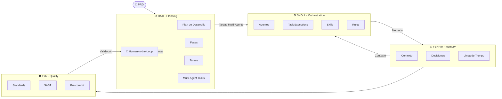
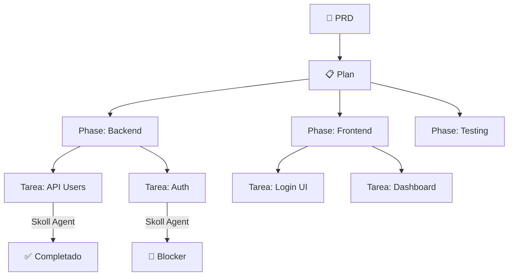

# Ragnarok Ecosystem v2.0.0

**AI Governance & Autonomous Development Ecosystem**

Sistema agentico de 4 plugins MCP diseñados para orchestrar agentes AI en proyectos de desarrollo, con **Agent-Based Orchestration** y validación humana en puntos clave.

---

## Arquitectura

### Flujo Principal: HATI → SKOLL → FENRIR → TYR



---

## Workflows de Alto Nivel

En lugar de múltiples llamadas MCP, Ragnarok ofrece **workflows** que executan todo internamente:

### 1. `workflow_project_bootstrap`
Inicializa la estructura completa de un proyecto:

```bash
workflow_project_bootstrap --project_path "./mi-proyecto" --project_name "MiApp"
```

**Ejecuta internamente:**
- `project_scan` → Detecta stack y tecnología
- `project_bootstrap` → Genera `.ragnarok/`
- `skill_generate` → Skills del proyecto
- `rules_generate` → Reglas del proyecto
- `standards_generate` → Standards del proyecto
- `agents_md_get` → Genera AGENTS.md

---

### 2. `workflow_prd_analyze`
Analiza un PRD y crea el plan de desarrollo:

```bash
workflow_prd_analyze --prd_file "./PRD.md" --project_path "./mi-proyecto"
```

**Ejecuta internamente:**
- `prd_parse` → Extrae requisitos
- `prd_requirements_extract` → Lista requisitos
- `plan_create_from_prd` → Crea plan con fases y tareas
- `human_review_create` → Solicita approval humano

---

### 3. `workflow_agentic_init`
Crea la estructura agentica completa:

```bash
workflow_agentic_init --title "MiApp" --phases "Backend,Frontend,Testing,Deploy"
```

**Ejecuta internamente:**
- `plan_create` → Crea plan
- `phase_create` (xN) → Crea fases
- `team_create` → Registra equipo
- `human_review_create` → Approval para asignar agentes

---

### 4. `workflow_plan_develop`
Ejecuta el desarrollo guiado por tareas:

```bash
workflow_plan_develop --plan_id "plan_xxx" --auto_continue true
```

**Flujo autónomo:**
```
while (tareas_pendientes) {
    task = task_get_next
    agent_skoll = ejecutar(task)
    task_update(status: "completed")
    
    if (is_milestone) {
        checkpoint_create
        human_review_create  // Approval antes de continuar
    }
}
```

---

### 5. `workflow_checkpoint_create`
Crea checkpoint de calidad:

```bash
workflow_checkpoint_create --plan_id "plan_xxx" --description "Milestone 1"
```

**Ejecuta internamente:**
- `checkpoint_open`
- `standard_run_all`
- `sast_run`
- `precommit_validate`
- `human_review_create` → Decision humana

---

## Human-in-the-Loop

Puntos donde se requiere validación humana:

| Punto | Tipo | Descripción |
|-------|------|-------------|
| Post PRD | `prd_approval` | "¿Aprobar este plan?" |
| Team Setup | `team_approval` | "¿Asignar agentes a fases?" |
| Post Phase | `phase_approval` | "¿Avanzar a siguiente fase?" |
| Post Milestone | `checkpoint_approval` | "¿Aprobar checkpoint?" |
| On Blocker | `blocker_resolution` | "¿Cómo resolver este blocker?" |
| Pre Deploy | `deploy_approval` | "¿Desplegar a producción?" |

---

## Agentes Especializados (SKOLL)

| Agente | Tipo | Skills | Ejecuta |
|--------|------|--------|---------|
| `backend-agent` | backend | go, python, api, db | endpoints, database |
| `frontend-agent` | frontend | react, vue, typescript | UI, components |
| `qa-agent` | qa | testing, jest, cypress | tests, e2e |
| `devops-agent` | devops | docker, k8s, ci/cd | deploy, infra |
| `security-agent` | security | sast, audit | security checks |
| `docs-agent` | docs | markdown, api-docs | documentation |

---

## Estructura de Datos

### PRD → Plan → Phase → Task



---

## Instalación

```powershell
irm https://raw.githubusercontent.com/andragon31/Ragnarok/v2.0.0/install.ps1 | iex
```

## Uso Rápido

```bash
# 1. Escanear proyecto
rag scan --path ./mi-proyecto --bootstrap

# 2. Analizar PRD y crear plan
workflow_prd_analyze --prd_file "./PRD.md" --project_path "./mi-proyecto"

# 3. Inicializar agentes
workflow_agentic_init --title "MiApp" --phases "Backend,Frontend,Testing"

# 4. Ejecutar desarrollo (delegación directa a agentes)
workflow_plan_develop --plan_id "plan_xxx" --auto_continue true
```

### Novedades v2.0.0

- **Multi-Agent Tasks**: Las tareas pueden asignarse a múltiples agentes simultáneamente
- **Agent-Based Orchestration**: Skoll delega directamente a agentes sin workflows
- **Task Executions**: Tracking granular de cada ejecución de tarea por agente
- **Workflows Deprecated**: Los workflows se reemplazan por task_* commands

---

## Herramientas Base (para uso granular)

| Plugin | Herramientas |
|--------|-------------|
| **Fenrir** | `mem_stats`, `mem_timeline`, `mem_context`, `mem_find`, `mem_save` |
| **Hati** | `plan_get`, `plan_list`, `task_create`, `task_get_next`, `task_update`, `task_assign_agents`, `task_agent_update` |
| **Skoll** | `skill_list`, `agent_list`, `agent_create`, `team_register`, `task_execute`, `task_delegate`, `task_status` |
| **Tyr** | `standard_run_all`, `sast_run`, `pkg_check`, `precommit_validate` |

---

## Ejemplo Completo

```bash
# 1. Crear PRD.md con requisitos...

# 2. Inicializar proyecto
rag init --project "mi-proyecto"

# 3. Escanear y bootstrap
rag scan --path ./mi-proyecto --bootstrap

# 4. Analizar PRD → Crea Plan con Tareas
workflow_prd_analyze --prd_file "./PRD.md" --project_path "./mi-proyecto"

# 5. El agente recibe notification de approval
#    Usuario aprueba via: human_review_decide --review_id "xxx" --decision "approved"

# 6. Ejecutar desarrollo automáticamente
workflow_plan_develop --plan_id "plan_xxx" --auto_continue true

# 7. En cada checkpoint, el agente notifica al humano
#    Usuario approves via: human_review_decide --review_id "yyy" --decision "approved"

# 8. Al final, usuario approves deploy
```

---

**v2.0.0** - Agent-Based Orchestration con Multi-Agent Tasks
