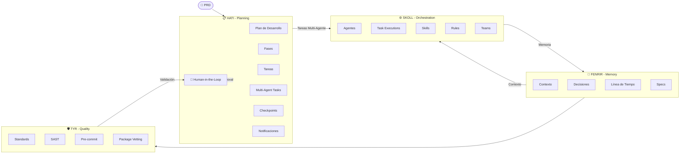
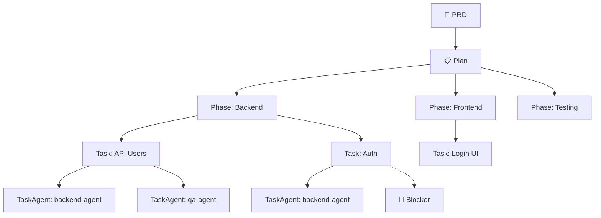

# Ragnarok Ecosystem v2.2.2

**AI Governance & Autonomous Development Ecosystem**

Sistema agentico de 4 módulos MCP diseñados para orquestar agentes AI en proyectos de desarrollo, con **Agent-Based Orchestration** y validación humana en puntos clave.

---

## Quick Start (Simplified Commands)

```bash
# 1. Crear nuevo proyecto (RECOMENDADO)
rag new --project myapi --path ./myapi --stack=go

# 2. Continuar proyecto existente
rag continue --plan <plan_id>

# 3. Nueva feature en proyecto
rag feature --name user-auth --plan <plan_id>

# 4. Revisión de calidad
rag review --plan <plan_id>

# 5. Ver estado
rag status --plan <plan_id>
```

---

## Arquitectura

### Flujo Principal: HATI → SKOLL → FENRIR → TYR



---

## Módulos

### 📋 HATI - Planning Layer
Gestión de planes de desarrollo, fases, tareas y validaciones humanas.

**Funcionalidades:**
- Creación y seguimiento de planes de desarrollo
- Fases con estados (pending, in_progress, completed, blocked)
- Tareas con soporte multi-agente (múltiples agentes por tarea)
- Checkpoints con approval humano
- Human-in-the-loop con múltiples tipos de approval
- Notificaciones push/pull

**Tablas principales:** `plans`, `phases`, `tasks`, `task_agents`, `checkpoints`, `human_reviews`, `notifications`

### Funciones: `plan_create`, `plan_get`, `plan_list`, `plan_complete`, `plan_abandon`, `plan_resume`, `plan_revise`, `plan_blockers`, `plan_dependencies`, `phase_create`, `phase_update`, `phase_start`, `phase_report`, `task_create`, `task_get`, `task_get_next`, `task_update`, `task_list`, `checkpoint_open`, `checkpoint_approve`, `human_review_create`, `human_review_decide`, `human_review_pending`, `notification_send`, `notification_list`, `spec_impact`, `quality_snapshot`, `prd_parse`, `prd_requirements_extract`

---

### ⚙️ SKOLL - Orchestration Layer
Orquestación de agentes, skills y ejecución de tarea.

**Funcionalidades:**
- Registro y tracking de agentes
- Skills basados en filesystem con metadata en SQLite
- Rules engine para validación
- Agent heartbeat y tracking
- Team management
- Skill matching automático por agent type

**Tablas principales:** `agents`, `skills`, `rules`, `task_executions`, `teams`

### Funciones: `skill_list`, `skill_load`, `skill_search`, `skill_verify`, `skill_version_check`, `skill_read_file`, `skills_import`, `skills_update`, `agent_list`, `agent_create`, `agent_get`, `agent_activate`, `agent_context`, `agent_handoff`, `agent_specialized_list`, `agent_assign_task`, `agent_complete_task`, `agent_heartbeat`, `agent_skills_get`, `team_create`, `team_get`, `rule_list`, `rule_check`, `rule_get`, `skoll_status`, `skoll_validate`, `bootstrap_import`

---

### 🧠 FENRIR - Memory Layer
Memoria institucional y contexto para agentes.

**Funcionalidades:**
- Observations con FTS5 full-text search
- Graph-based context search
- Sessions con tracking de actividad
- Specs con delta history
- Project scanning y bootstrap
- Memory deduplication y TTL

**Tablas principales:** `observations`, `sessions`, `specs`, `nodes`, `edges`

### Funciones: `mem_save`, `mem_find`, `mem_context`, `mem_timeline`, `mem_stats`, `mem_session_start`, `mem_session_end`, `mem_save_prompt`, `mem_session_checkpoint`, `mem_get_observation`, `spec_save`, `spec_list`, `spec_delta`, `spec_impact`, `spec_check`, `project_scan`, `project_bootstrap`, `skill_generate`, `rules_generate`, `standards_generate`, `prompt_analyze`, `agents_md_get`

---

### 🛡️ TYR - Quality Layer
Validación de código, seguridad y estándares.

**Funcionalidades:**
- SAST scanner con rules engine
- Package vetting (npm, pypi, go, cargo, nuget, maven, rubygems, packagist)
- CVE/GitHub Advisories integration
- Standards execution con pass rate tracking
- Pre-commit validation

**Tablas principales:** `sast_findings`, `pkg_cache`, `standards`, `standards_results`

### Funciones: `pkg_check`, `pkg_license`, `pkg_audit`, `pkg_audit_snapshot`, `pkg_audit_continuous`, `sast_run`, `sast_findings`, `sast_resolve`, `standard_list`, `standard_run`, `standard_run_all`, `precommit_validate`, `precommit_autofix`, `bootstrap_import`, `quality_snapshot`

---

## Workflows de Alto Nivel

En lugar de múltiples llamadas MCP, Ragnarok ofrece **workflows** que ejecutan todo internamente:

### 1. `rag new` (CLI) → `workflow_stack_based_init` ⭐ RECOMENDADO
Inicializa proyecto detectando stack automáticamente y creando fases/tareas apropiadas.

```bash
rag new --project myapi --path ./myapi --stack=go
```

**Ejecuta internamente:**
- `project_scan` → Detecta stack (Go, Node, Python, etc.), arquitectura, CI/CD
- `plan_create` → Crea plan basado en el stack detectado
- `phase_create` → Crea fases según stack
- `task_create` → Crea tareas específicas del stack
- `human_review_create` → Solicita approval humano

### 2. `rag continue` (CLI) → `workflow_plan_develop_v2` ⭐ RECOMENDADO
Ejecuta el desarrollo con delegación multi-agente.

```bash
rag continue --plan <plan_id>
```

**Flujo autónomo:**
```
while (tareas_pendientes) {
    task = task_get_next(plan_id, agent_id)
    if (task.tiene_agentes) {
        task_execute(task_id, agente.id)
    } else {
        task_update(status: "in_progress")
    }
    
    if (is_milestone) {
        checkpoint_create
        human_review_create
    }
}
```

### 3. `rag review` (CLI) → `workflow_checkpoint_create`
Crea checkpoint de calidad con validaciones.

```bash
rag review --plan <plan_id>
```

**Ejecuta:**
- `checkpoint_open`
- `standard_run_all`
- `sast_run`
- `precommit_validate`
- `human_review_create`

### 4. `rag status` (CLI)
Muestra estado del ecosistema y plan.

```bash
rag status --plan <plan_id>
```

### 5. `rag feature` (CLI)
Crea nueva feature en un plan existente.

```bash
rag feature --name user-auth --plan <plan_id>
```

---

## Human-in-the-Loop

Puntos donde se requiere validación humana:

| Punto | Tipo | Descripción |
|-------|------|-------------|
| Post PRD | `prd_approval` | "¿Aprobar este plan?" |
| Post Milestone | `checkpoint_approval` | "¿Aprobar checkpoint?" |
| On Blocker | `blocker_resolution` | "¿Cómo resolver este blocker?" |
| Pre Deploy | `deploy_approval` | "¿Desplegar a producción?" |

---

## Agentes Especializados (SKOLL)

| Agente | Tipo | Skills | Ejecuta |
|--------|------|--------|---------|
| `backend-agent` | backend | go, python, api, db | endpoints, database |
| `frontend-agent` | frontend | react, vue, typescript | UI, components |
| `qa-agent` | qa | testing, jest, cypress | tests, e2e |
| `devops-agent` | devops | docker, k8s, ci/cd | deploy, infra |
| `security-agent` | security | sast, audit | security checks |
| `docs-agent` | docs | markdown, api-docs | documentation |

---

## Estructura de Datos

### PRD → Plan → Phase → Task → TaskAgent



---

## Instalación

```powershell
irm https://raw.githubusercontent.com/andragon31/Ragnarok/v2.1.0/install.ps1 | iex
```

---

## Uso Rápido

```bash
# 1. Crear nuevo proyecto (RECOMENDADO)
rag new --project myapi --path ./myapi --stack=go

# 2. Continuar proyecto existente
rag continue --plan <plan_id>

# 3. Nueva feature en proyecto
rag feature --name user-auth --plan <plan_id>

# 4. Revisión de calidad
rag review --plan <plan_id>

# 5. Ver estado
rag status --plan <plan_id>

# 6. Inicializar plugins (primera vez)
rag init --project mi-proyecto

# 7. Escanear proyecto existente
rag scan --path ./mi-proyecto

# 8. Iniciar servidor MCP
rag serve
```

---

## Changelog

### v2.1.0 (Latest)
**Simplified Commands:**
- Nuevo CLI: `rag new`, `rag continue`, `rag feature`, `rag review`, `rag status`
- Agregados métodos `ExecuteWorkflow` y `CallTool` en unified server
- Comandos simplificados para uso directo por agentes

**Funciones Eliminadas (59 total):**
- Hati: `plan_lock`, `plan_unlock`, `plan_quality`, `plan_completeness`, `plan_recover`, `plan_restart`, `checkpoint_decide`, `checkpoint_status`, `checkpoint_escalate`, `checkpoint_check_sla`, `checkpoint_set_sla`, `feedback_request`, `feedback_receive`, `feedback_escalate`, `notification_ack`, `record_list`, `record_get`, `record_export`, `module_hints`, `learning_answer`, `hati_status`, `hati_stats`, `hati_commit_info`, `hati_register_commit`, `agent_register_work`, `agent_unregister_work`, `agent_list_work`
- Fenrir: `bias_report`, `intent_save`, `intent_get`, `intent_verify`, `incident_log`, `incident_list`, `incident_resolve`, `conflict_list`, `conflict_resolve`
- Skoll: `workflow_start`, `workflow_step`, `workflow_status`, `workflow_complete`, `workflow_deprecate`, `task_execute`, `task_delegate`, `task_status`, `task_heartbeat`, `task_complete`, `task_cancel`, `rule_pending`, `rule_promote`, `team_status`, `team_register`, `api_docs_check`, `dod_check`
- Tyr: `audit_log`, `session_audit`, `inject_guard`, `proactive_scan`, `sanitize`, `scope_violations`, `tyr_stats`

### v2.0.6
- Schema validation tests para Hati, Skoll, Fenrir, Tyr
- Fix: `columnExists()` en migration para SQLite más antiguo

### v2.0.3
- Fix multi-digit phase numbers bug (strconv.Itoa vs rune)
- Add thread-safety (sync.Mutex) to generateID in all modules
- Fix DB error ignored in Hati plan_recover handler
- Implement standard_run_all (was stub returning zeros)
- Add PRAGMA foreign_keys = ON to all databases
- Add 30s timeout to MCP handler calls

### v2.0.1
- Multi-Agent Tasks: tasks can have multiple agents assigned
- Agent-Based Orchestration: Skoll delegates directly to agents
- Task Executions: granular tracking per execution
- workflow_stack_based_init: auto-detects project stack
- workflow_plan_develop_v2: multi-agent task delegation

### v1.4.x
- Initial stable release with 4-module architecture
- Human-in-the-loop checkpoints
- Basic agent registration and work tracking

---

**v2.1.0** - Simplified Commands for Agent Workflows
