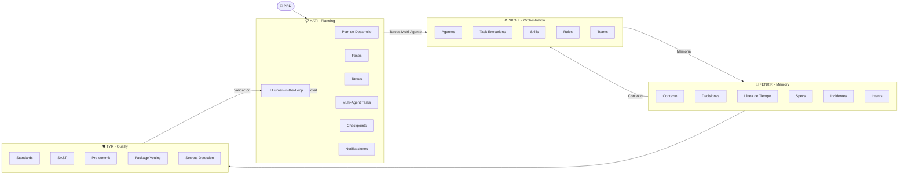
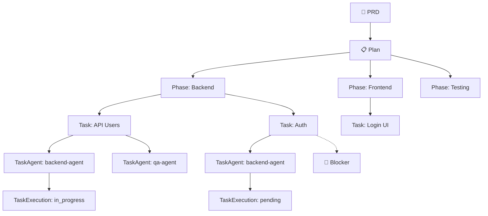

# Ragnarok Ecosystem v2.0.3

**AI Governance & Autonomous Development Ecosystem**

Sistema agentico de 4 módulos MCP diseñados para orquestar agentes AI en proyectos de desarrollo, con **Agent-Based Orchestration** y validación humana en puntos clave.

---

## Arquitectura

### Flujo Principal: HATI → SKOLL → FENRIR → TYR



---

## Módulos

### 📋 HATI - Planning Layer
Gestión de planes de desarrollo, fases, tareas y validaciones humanas.

**Funcionalidades:**
- Creación y seguimiento de planes de desarrollo
- Fases con estados (pending, in_progress, completed, blocked)
- Tareas con soporte multi-agente (múltiples agentes por tarea)
- Checkpoints con SLAs y escalamiento
- Human-in-the-loop con múltiples tipos de approval
- Notificaciones push/pull
- Blockers y recovery automático

**Tablas principales:** `plans`, `phases`, `tasks`, `task_agents`, `checkpoints`, `human_reviews`, `notifications`, `execution_blockers`, `plan_recovery`

---

### ⚙️ SKOLL - Orchestration Layer
Orquestación de agentes, skills y ejecución de tareas.

**Funcionalidades:**
- Registro y tracking de agentes
- Skills basados en filesystem con metadata en SQLite
- Rules engine para validación
- Task executions con heartbeat y tracking granular
- Workflows deprecated en favor de task delegation
- Team management
- Skill matching automático por agent type

**Tablas principales:** `agents`, `skills`, `rules`, `task_executions`, `workflows`, `teams`, `agent_work`

---

### 🧠 FENRIR - Memory Layer
Memoria institucional y contexto para agentes.

**Funcionalidades:**
- Observations con FTS5 full-text search
- Graph-based context search
- Sessions con tracking de actividad
- Specs con delta history
- Incidents y conflicts tracking
- Intents verification system
- Project scanning y bootstrap
- Memory deduplication y TTL

**Tablas principales:** `observations`, `sessions`, `specs`, `incidents`, `conflicts`, `intents`, `biases`, `nodes`

---

### 🛡️ TYR - Quality Layer
Validación de código, seguridad y estándares.

**Funcionalidades:**
- SAST scanner con rules engine
- Package vetting (npm, pypi, go, cargo)
- CVE/GitHub Advisories integration (con soporte GITHUB_TOKEN)
- Standards execution con pass rate tracking
- Pre-commit validation
- Secrets detection
- Scope violations
- Audit logging completo

**Tablas principales:** `sast_findings`, `pkg_cache`, `standards`, `standards_results`, `audit_log`, `cve_alerts`, `secrets_findings`

---

## Workflows de Alto Nivel

En lugar de múltiples llamadas MCP, Ragnarok ofrece **workflows** que executan todo internamente:

### 1. `workflow_stack_based_init` ⭐ RECOMENDADO
Inicializa proyecto detectando stack automáticamente y creando fases/tareas apropiadas:

```bash
workflow_stack_based_init --project_path "./mi-proyecto" --title "MiApp"
```

**Ejecuta internamente:**
- `project_scan` → Detecta stack (Go, Node, Python, etc.), arquitectura, CI/CD
- `plan_create` → Crea plan basado en el stack detectado
- `phase_create` → Crea fases según stack
- `task_create` → Crea tareas específicas del stack
- `task_assign_agents` → Asigna agentes según tipo de tarea
- `human_review_create` → Solicita approval humano

**Fases generadas según stack:**
| Stack | Fases |
|-------|-------|
| Go | Setup, Backend, API, Database, Testing, DevOps, Documentation |
| Node/React | Setup, Frontend, API, Database, Testing, DevOps, Documentation |
| Python | Setup, Backend, API, Database, Testing, DevOps, Documentation |
| Multi-stack | Setup, Backend, Frontend, Database, Testing, DevOps, Documentation |

---

### 2. `workflow_plan_develop_v2` ⭐ RECOMENDADO
Ejecuta el desarrollo con delegación multi-agente:

```bash
workflow_plan_develop_v2 --plan_id "plan_xxx" --auto_continue true
```

**Flujo autónomo:**
```
while (tareas_pendientes) {
    task = task_get_next(plan_id, agent_id)
    if (task.tiene_agentes) {
        for each agente in task.agentes {
            task_execute(task_id, agente.id)
        }
    } else {
        task_update(status: "in_progress")
    }
    
    if (is_milestone) {
        checkpoint_create
        human_review_create
    }
}
```

---

### 3. `workflow_checkpoint_create`
Crea checkpoint de calidad con validaciones:

```bash
workflow_checkpoint_create --plan_id "plan_xxx" --description "Milestone 1"
```

**Ejecuta:**
- `checkpoint_open`
- `standard_run_all`
- `sast_run`
- `precommit_validate`
- `human_review_create`

---

### 4. `workflow_session_start`
Inicia sesión de trabajo con contexto:

```bash
workflow_session_start --goal "Implementar feature X" --module "backend"
```

---

## Human-in-the-Loop

Puntos donde se requiere validación humana:

| Punto | Tipo | Descripción |
|-------|------|-------------|
| Post PRD | `prd_approval` | "¿Aprobar este plan?" |
| Team Setup | `team_approval` | "¿Asignar agentes a fases?" |
| Post Phase | `phase_approval` | "¿Avanzar a siguiente fase?" |
| Post Milestone | `checkpoint_approval` | "¿Aprobar checkpoint?" |
| On Blocker | `blocker_resolution` | "¿Cómo resolver este blocker?" |
| Pre Deploy | `deploy_approval` | "¿Desplegar a producción?" |

---

## Agentes Especializados (SKOLL)

| Agente | Tipo | Skills | Ejecuta |
|--------|------|--------|---------|
| `backend-agent` | backend | go, python, api, db | endpoints, database |
| `frontend-agent` | frontend | react, vue, typescript | UI, components |
| `qa-agent` | qa | testing, jest, cypress | tests, e2e |
| `devops-agent` | devops | docker, k8s, ci/cd | deploy, infra |
| `security-agent` | security | sast, audit | security checks |
| `docs-agent` | docs | markdown, api-docs | documentation |

---

## Herramientas Base (por módulo)

### HATI - Planning
```
plan_create, plan_get, plan_list, plan_complete, plan_abandon, plan_resume
plan_revise, plan_quality, plan_completeness, plan_restart, plan_recover
plan_blockers, plan_dependencies, plan_lock, plan_unlock, plan_activate
phase_create, phase_update, phase_start, phase_report
task_create, task_get, task_update, task_get_next, task_list, task_set_blocker
task_assign_agents, task_agent_update
checkpoint_open, checkpoint_decide, checkpoint_status, checkpoint_approve
checkpoint_set_sla, checkpoint_escalate, checkpoint_check_sla
human_review_create, human_review_decide, human_review_pending
feedback_request, feedback_receive, feedback_escalate
notification_send, notification_list, notification_ack
record_list, record_get, record_export
```

### SKOLL - Orchestration
```
skill_list, skill_load, skill_search, skill_generate, skill_verify
skill_version_check, skill_read_file, skills_import, skills_update
agent_list, agent_create, agent_get, agent_activate, agent_handoff
agent_register_work, agent_unregister_work, agent_list_work
agent_skills_get, agent_complete_task, agent_heartbeat
team_create, team_get, team_register, team_status
task_execute, task_delegate, task_status, task_heartbeat
task_complete, task_cancel
workflow_deprecate
```

### FENRIR - Memory
```
mem_save, mem_find, mem_context, mem_timeline, mem_stats
mem_session_start, mem_session_end, mem_save_prompt
mem_get_observation
spec_save, spec_list, spec_delta, spec_impact, spec_check
intent_save, intent_get, intent_verify
incident_log, incident_list, incident_resolve
conflict_list, conflict_resolve
project_scan, project_bootstrap
agents_md_get
module_hints
```

### TYR - Quality
```
standard_list, standard_run, standard_run_all
sast_run, sast_findings, sast_resolve
pkg_check, pkg_license, pkg_audit, pkg_audit_snapshot
precommit_validate, precommit_autofix
rule_list, rule_check, rule_get, rule_promote, rule_pending
scope_violations, quality_snapshot
bias_report, learning_answer
inject_guard
audit_log, session_audit
```

---

## Instalación

```powershell
irm https://raw.githubusercontent.com/andragon31/Ragnarok/v2.0.3/install.ps1 | iex
```

---

## Uso Rápido

```bash
# 1. Inicializar proyecto con detección automática de stack (RECOMENDADO)
workflow_stack_based_init --project_path "./mi-proyecto" --title "MiApp"

# 2. Analizar PRD y crear plan
workflow_prd_analyze --prd_file "./PRD.md" --project_path "./mi-proyecto"

# 3. Ejecutar desarrollo con multi-agente (RECOMENDADO)
workflow_plan_develop_v2 --plan_id "plan_xxx" --auto_continue true

# 4. Crear checkpoint de calidad
workflow_checkpoint_create --plan_id "plan_xxx" --description "Milestone 1"
```

---

## Changelog

### v2.0.3 (Latest)
**Bug Fixes:**
- Fix multi-digit phase numbers bug (strconv.Itoa vs rune)
- Add thread-safety (sync.Mutex) to generateID in all modules
- Fix DB error ignored in Hati plan_recover handler
- Implement standard_run_all (was stub returning zeros)
- Add PRAGMA foreign_keys = ON to all databases
- Add 30s timeout to MCP handler calls
- Fix err shadowing in Fenrir mem_find
- Add logging for skill loading errors in Skoll
- Add GITHUB_TOKEN env var support for Tyr

### v2.0.2
- Tests for task handlers and workflow handlers
- Updated workflow_prd_analyze with stack detection
- Deprecated marks on old workflows
- .gitignore for release files

### v2.0.1
- Multi-Agent Tasks: tasks can have multiple agents assigned
- Agent-Based Orchestration: Skoll delegates directly to agents
- Task Executions: granular tracking per execution
- workflow_stack_based_init: auto-detects project stack
- workflow_plan_develop_v2: multi-agent task delegation

### v1.4.x
- Initial stable release with 4-module architecture
- Human-in-the-loop checkpoints
- Basic agent registration and work tracking

---

## Estructura de Datos

### PRD → Plan → Phase → Task → TaskAgent



---

**v2.0.3** - Agent-Based Orchestration con Multi-Agent Tasks y Quality Assurance
