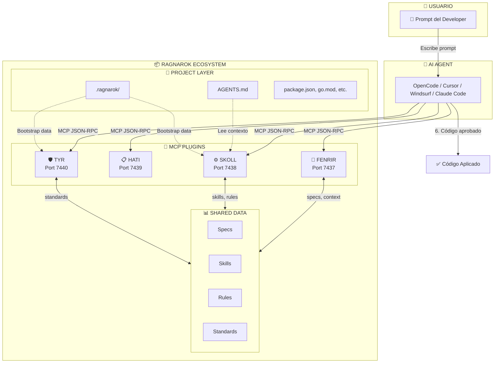
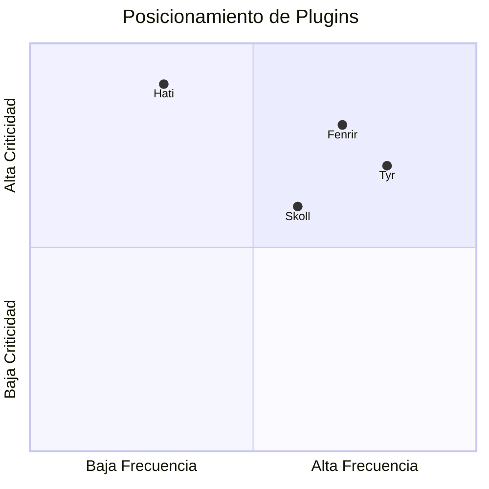
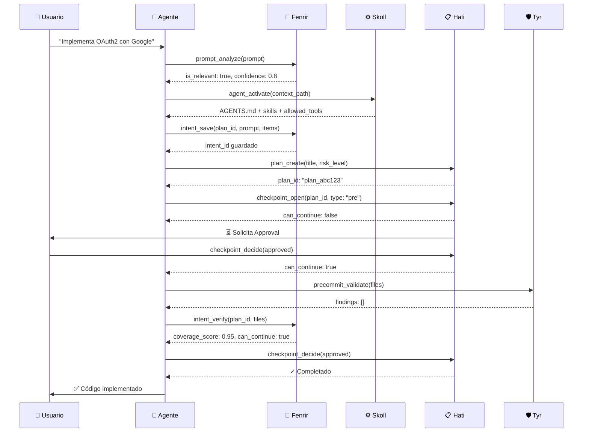
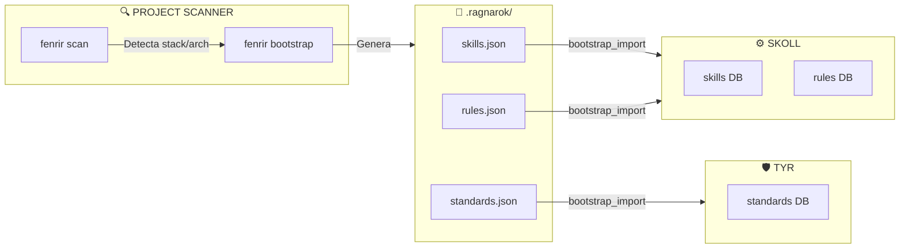
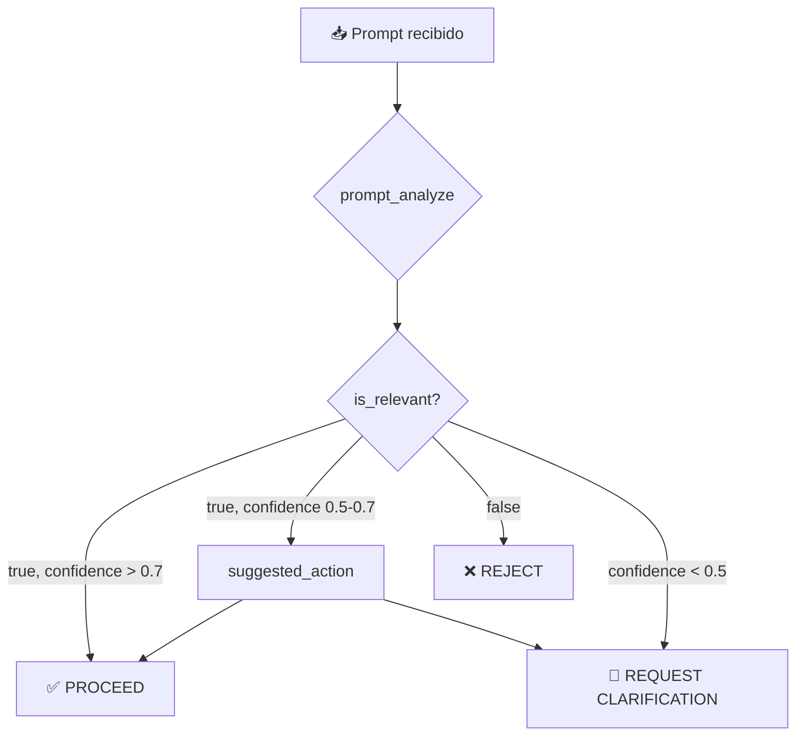
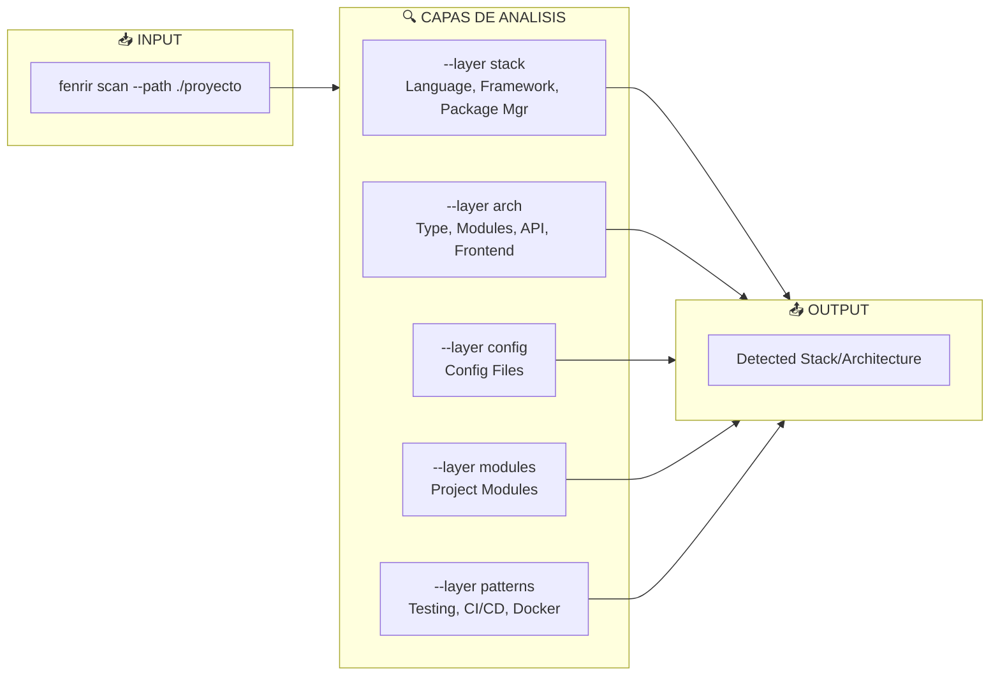
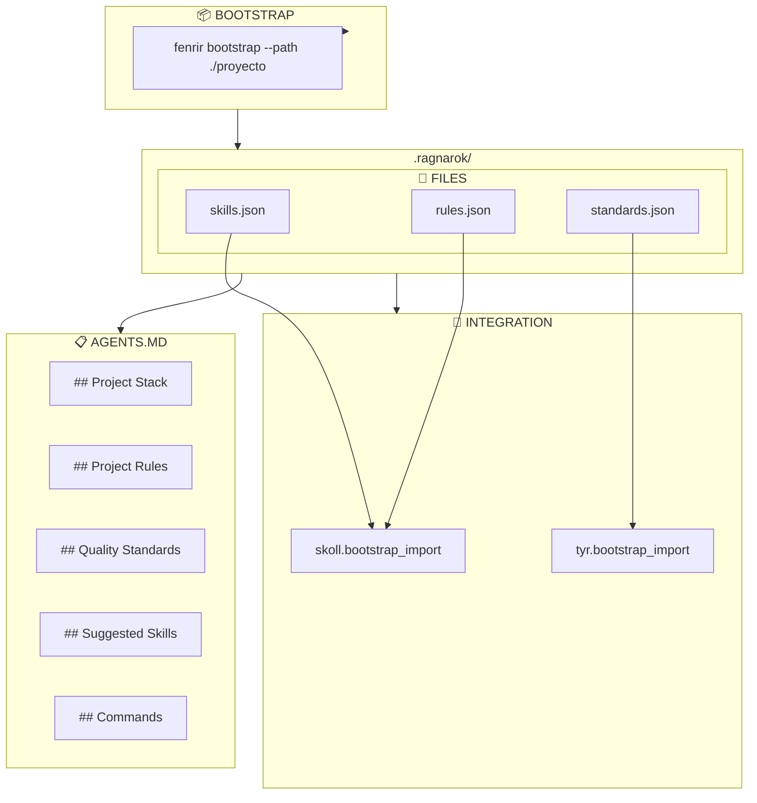
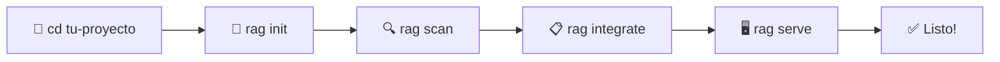
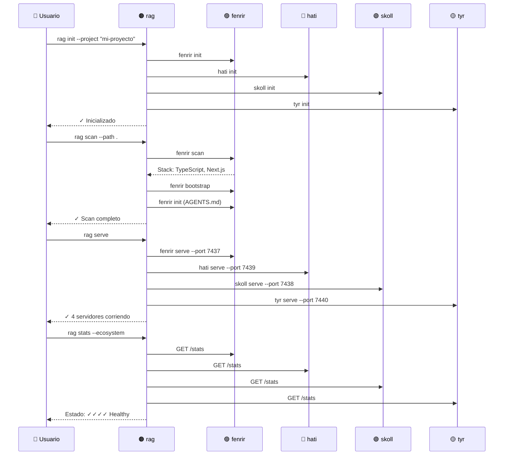
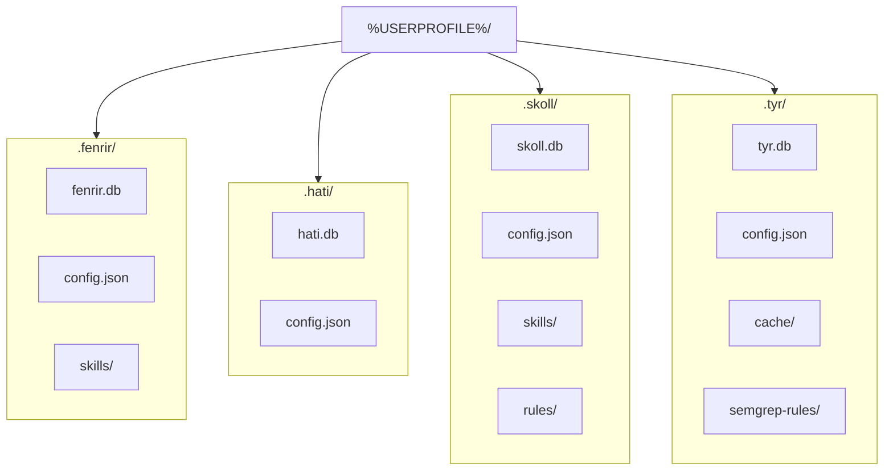

# Ragnarok Ecosystem v1.1.0

**Memory, Knowledge & Institutional Intelligence for AI Agents**

Ecosistema de 4 plugins MCP diseñados para orquestar agentes AI (OpenCode, Cursor, Windsurf, Claude Code) en proyectos de desarrollo Windows.

---

## Tabla de Contenidos

1. [Arquitectura General](#1-arquitectura-general)
2. [Flujo de Integración](#2-flujo-de-integración)
3. [Plugins Detallados](#3-plugins-detallados)
   - [Fenrir (Memory & Knowledge)](#31-fenrir-memory--knowledge)
   - [Hati (Planning & Approvals)](#32-hari-planning--approvals)
   - [Skoll (Skills & Rules)](#33-skoll-skills--rules)
   - [Tyr (Security & Validation)](#34-tyr-security--validation)
4. [Project Scanner & Bootstrap](#4-project-scanner--bootstrap)
5. [Guía de Usuario](#5-guía-de-usuario)
   - [5.1 Primeros Pasos](#51--primeros-pasos--flujo-completo)
   - [5.2 Comandos Ragnarok](#52--comandos-ragnarok-rag)
   - [5.3 Comandos por Plugin](#53--comandos-por-plugin)
   - [5.4 Ejemplos Prácticos](#54--ejemplos-prácticos)
   - [5.5 Configuración de Agentes](#55--configuración-de-agentes-ai)
   - [5.6 Estructura de Archivos](#56--📁-estructura-de-archivos-generados)
   - [5.7 Solución de Problemas](#57--⚠️-solución-de-problemas)
   - [5.8 Flujo Completo Visual](#58--📊-flujo-completo-visual)
6. [Referencia de Comandos](#6-referencia-de-comandos)
   - [6.1 Comandos Macro](#61-comandos-macro-rag)
   - [6.2 Comandos por Plugin](#62-comandos-por-plugin)
   - [6.3 Puertos Default](#63-puertos-default)
7. [MCP Tools Catalog](#7-mcp-tools-catalog)
8. [Configuración](#8-configuración)
7. [MCP Tools Catalog](#7-mcp-tools-catalog)
8. [Configuración](#8-configuración)

---

## 1. Arquitectura General

### 1.1 Vista del Sistema



### 1.2 Responsabilidades de Cada Plugin



| Plugin | Pregunta que responde | Frecuencia | Criticidad |
|--------|---------------------|------------|------------|
| **Fenrir** | ¿Qué sabemos sobre el proyecto? | Alta | Alta |
| **Hati** | ¿Cuál es el plan y quién lo aprueba? | Baja | Muy Alta |
| **Skoll** | ¿Quién hace qué y cómo? | Media | Media |
| **Tyr** | ¿Es seguro lo que hacemos? | Alta | Alta |

---

## 2. Flujo de Integración

### 2.1 Flujo Completo de un Prompt



### 2.2 Diagrama de Flujo de Datos



### 2.3 Gatekeeping de Prompts



---

## 3. Plugins Detallados

### 3.1 Fenrir (Memory & Knowledge)

**¿Qué hace?**
Fenrir es la memoria institucional del proyecto. Captura y recupera todo el contexto: decisiones tomadas, specs creadas, incidentes resueltos, y conocimiento del dominio. Es quien responde "¿qué sabemos sobre este proyecto?".

**¿Por qué es importante?**
Sin Fenrir, cada sesión del agente empieza en blanco. Con Fenrir, el agente tiene acceso a años de decisiones, specs y conocimiento acumulado. Evita que el agente repita errores o contradiga decisiones previas.

---

#### Memory Tools — Gestión de Sesiones y Observaciones

| Tool | Descripción |
|------|-------------|
| `mem_session_start` | Inicia una sesión de trabajo. Registra el proyecto, módulo y objetivo. Permite rastrear todo lo que ocurre durante la sesión. |
| `mem_session_end` | Cierra la sesión actual y calcula métricas: duración, tokens usados, decisiones tomadas. Genera un resumen para futuras referencias. |
| `mem_save` | Guarda una observación en la memoria. Una observación puede ser una decisión ("usamos PostgreSQL para auth"), un aprendizaje ("error X sucede cuando Y"), o un contexto ("el módulo Z fue refactoreado en 2024"). |
| `mem_find` | Busca en la memoria usando FTS5 (búsqueda full-text). Encuentra observaciones relevantes al contexto actual. Ejemplo: "mem_find('authentication oauth')" retorna todas las observaciones sobre auth. |
| `mem_get_observation` | Recupera una observación específica por su ID. Útil para ver detalles completos de una decisión o aprendizaje previo. |

#### Specs Tools — Especificaciones y Requisitos

| Tool | Descripción |
|------|-------------|
| `spec_save` | Crea o actualiza una especificación. Una spec define qué debe hacer una feature usando formato Given/When/Then. Ejemplo: "Given el usuario no está autenticado, When accede a /dashboard, Then debe ver login". |
| `spec_list` | Lista todas las specs del proyecto, filtrables por módulo, status o tipo. Muestra qué features están especadas y cuáles faltan. |
| `spec_check` | Verifica si el código implementado cumple una spec. Compara las condiciones Given/When/Then con el código real. |
| `spec_delta` | Registra cambios en specs. Cuando una spec evoluciona, delta registra qué cambió y por qué. Mantiene historial de evolución. |
| `spec_related` | Encuentra specs relacionadas con una feature o módulo. Útil para entender el contexto completo antes de implementar. |

#### Intent Tools — Tracking de Intenciones

| Tool | Descripción |
|------|-------------|
| `intent_save` | Guarda la intención del agente: qué planea hacer y por qué. Crea un registro antes de actuar. |
| `intent_verify` | Verifica que el código implementado matches la intención guardada. Calcula un coverage score. |
| `intent_get` | Recupera la intención actual o pasada para un plan. Permite comparar qué se planeó vs qué se hizo. |

#### Bias Tools — Detección de Sesgos

| Tool | Descripción |
|------|-------------|
| `bias_report` | Registra cuando el agente detecta bias en su propio razonamiento. Reporta el tipo de bias y la corrección aplicada. |

#### Authority Tools — Autoridad y Validación

| Tool | Descripción |
|------|-------------|
| `authority_get` | Obtiene la autoridad actual para un módulo o decisión. Define quién puede aprobar qué. |
| `authority_set` | Establece la autoridad para un contexto. Ejemplo: "authority_set(module: 'payments', role: 'tech-lead')". |

#### Incident Tools — Gestión de Incidentes

| Tool | Descripción |
|------|-------------|
| `incident_save` | Registra un incidente: bug, error, o problema detectado. Incluye severity, módulo afectado y solución propuesta. |
| `incident_list` | Lista incidentes abiertos o resueltos. Filtra por módulo, severity o fecha. |
| `incident_resolve` | Marca un incidente como resuelto y registra la solución aplicada. |
| `conflict_detect` | Detecta conflictos con decisiones o specs previas. Advierte cuando el código actual contradice el historial. |

#### Scanner Tools — Análisis de Proyecto

| Tool | Descripción |
|------|-------------|
| `prompt_analyze` | Analiza si un prompt del usuario es relevante para el proyecto. Retorna is_relevant y confidence. Descarta prompts fuera de scope. |
| `project_scan` | Escanea el proyecto y detecta: lenguaje, framework, package manager, arquitectura, módulos y patrones (CI/CD, Docker, tests). |
| `project_bootstrap` | Genera archivos de configuración para el agente: skills.json, rules.json, standards.json basados en el stack detectado. |
| `agents_md_get` | Lee el AGENTS.md del proyecto y retorna su contenido. Proporciona instrucciones específicas del proyecto al agente. |

#### Knowledge Tools — Grafo de Conocimiento

| Tool | Descripción |
|------|-------------|
| `knowledge_query` | Query sobre el grafo de conocimiento. Encuentra relaciones entre conceptos, módulos o decisiones. |
| `knowledge_add` | Añade nodos y edges al grafo. Construye ontología del proyecto con el tiempo. |

---

### 3.2 Hati (Planning & Approvals)

**¿Qué hace?**
Hati es el sistema de planeación y aprobación. Crea planes de acción, define fases, y establece checkpoints de approval antes de proceder. Es quien responde "¿cuál es el plan y quién lo aprueba?".

**¿Por qué es importante?**
Sin Hati, el agente actúa sin estructura ni supervisión. Con Hati, cada feature sigue un flujo controlado: plan → fases → approval → implementación → verificación. Reduce riesgo y mejora calidad.

---

#### Plan Tools — Gestión de Planes

| Tool | Descripción |
|------|-------------|
| `plan_create` | Crea un nuevo plan para una feature o tarea. Define título, descripción, risk_level y módulos afectados. Un plan agrupa fases y checkpoints. |
| `plan_get` | Obtiene los detalles de un plan específico: fases, status, métricas de calidad. |
| `plan_update` | Actualiza un plan: cambia status, añade notas, actualiza risk_level. |
| `plan_list` | Lista todos los planes del proyecto, filtrables por status (draft, active, completed). |

#### Phase Tools — Fases del Plan

| Tool | Descripción |
|------|-------------|
| `phase_add` | Añade una fase a un plan. Cada fase tiene nombre, descripción, orden y risk_level. Ejemplo: "phase 1: research", "phase 2: implementation", "phase 3: testing". |
| `phase_list` | Lista las fases de un plan en orden. Muestra cuál está activa, completada o pendiente. |
| `phase_complete` | Marca una fase como completada y avanza a la siguiente. Registra qué se hizo en esa fase. |

#### Checkpoint Tools — Puntos de Approval

| Tool | Descripción |
|------|-------------|
| `checkpoint_open` | Abre un checkpoint de approval. Un checkpoint pausa la ejecución hasta que alguien (humano o agente) approve o reject. Tipos: "pre" (antes de empezar), "mid" (entre fases), "post" (al finalizar). |
| `checkpoint_decide` | Registra la decisión de un checkpoint: approved o rejected. Si approved, el flujo continúa. Si rejected, se registra la razón y el plan debe replanificarse. |
| `checkpoint_status` | Consulta el estado de un checkpoint: pending, approved, rejected. Muestra quién tomó la decisión y cuándo. |

#### Decision Tools — Registro de Decisiones

| Tool | Descripción |
|------|-------------|
| `decision_record` | Registra una decisión tomada durante la implementación: tecnología elegida, trade-off aceptado, fallback planeado. |
| `decision_get` | Recupera una decisión específica con su contexto yrazón. |
| `decision_list` | Lista todas las decisiones de un plan o proyecto. Útil para code reviews y onboarding. |
| `decision_cancel` | Cancela una decisión si fue revocada o reemplazada. Mantiene historial pero la marca como inactiva. |

#### Quality Tools — Métricas de Calidad

| Tool | Descripción |
|------|-------------|
| `quality_snapshot` | Captura el estado de calidad actual: coverage, lint errors, debt acumulado. Genera snapshot para comparar evolución. |
| `spec_impact` | Calcula el impacto de un plan en las specs: cuántas specs se ven afectadas, modificadas o creadas. |
| `spec_status` | Consulta el estado de specs relacionadas: cuáles están cumplidas, cuáles faltan, cuáles tienen debt. |

#### Feedback Tools — Retroalimentación

| Tool | Descripción |
|------|-------------|
| `feedback_save` | Guarda feedback de una fase o checkpoint. Puede ser de un reviewer humano o de un agente validando. |
| `feedback_list` | Lista el feedback de un plan o fase. Muestra tendencias y áreas de mejora. |

#### Status Tools — Estado del Sistema

| Tool | Descripción |
|------|-------------|
| `hati_status` | Estado general de Hati: planes activos, fases completadas, checkpoints pendientes. |
| `hati_stats` | Estadísticas: tiempo promedio de approval, planes por risk_level, decisiones por día. |

---

### 3.3 Skoll (Skills & Rules)

**¿Qué hace?**
Skoll es el orquestador RSAW (Rules, Skills, Agents, Workflows). Define quién hace qué (Agents), cómo lo hace (Skills), qué reglas debe seguir (Rules), y en qué orden (Workflows). Es quien responde "¿quién hace qué y cómo?".

**¿Por qué es importante?**
Sin Skoll, el agente no sabe qué skills existen ni qué reglas seguir. Con Skoll, el equipo define estándares, el agente sabe qué skills usar, y cada trabajo sigue el workflow correcto.

---

#### Skill Tools — Gestión de Habilidades

| Tool | Descripción |
|------|-------------|
| `skill_list` | Lista todas las skills disponibles en formato "progressive disclosure": solo metadata liviana (nombre, descripción, triggers). No carga contenido completo para ahorrar tokens. |
| `skill_load` | Carga una skill completa: contenido del SKILL.md, archivos disponibles en scripts/references/assets, y allowed-tools pre-aprobados. |
| `skill_search` | Busca skills por nombre, descripción o framework. Retorna matches relevantes ordenados por similitud. |
| `skill_verify` | Verifica que una skill es válida: tiene description, no tiene path traversal, y sus referencias existen. |
| `skill_read_file` | Lee un archivo específico de una skill: un script en `scripts/`, una referencia en `references/`, o un asset en `assets/`. |
| `bootstrap_import` | Importa skills desde .ragnarok/ generado por fenrir bootstrap. Inserta skills detectadas del stack en la DB de Skoll. |
| `skills_import` | Importa skills desde GitHub (`--source github --url <url>`) o busca en GitHub (`--source skillsmp --query <texto>`). Descarga SKILL.md y lo instala localmente. |

#### Rule Tools — Gestión de Reglas

| Tool | Descripción |
|------|-------------|
| `rule_list` | Lista todas las reglas activas, filtrables por categoría (quality, security, architecture). Muestra contenido y severity. |
| `rule_check` | Verifica si una acción viola alguna regla. Retorna allowed: true/false y reglas que aplican. |
| `rule_get` | Obtiene el detalle de una regla específica: contenido completo, categoría, severidad, y razón de existencia. |

#### Agent Tools — Gestión de Agentes

| Tool | Descripción |
|------|-------------|
| `agent_list` | Lista todos los agentes registrados en el equipo. Muestra scope, skills asignados, y si están activos. |
| `agent_activate` | Activa un agente para un contexto específico. Retorna: allowed_tools (del skill activo), skills sugeridas, y contexto del AGENTS.md. Lee AGENTS.md anidados en monorepos. |
| `agent_context` | Obtiene el contexto actual de un agente: skills activas, scope, reglas que aplican. |
| `agent_handoff` | Transfiere trabajo de un agente a otro. Incluye el contrato (qué se hizo, qué falta) para continuidad. |

#### Workflow Tools — Gestión de Flujos

| Tool | Descripción |
|------|-------------|
| `workflow_start` | Inicia un workflow definido (ej: feature-development, bug-fix, refactor). Crea una nueva instancia con status "started". |
| `workflow_step` | Registra un paso completado en el workflow. Permite trackear progreso por fases. |
| `workflow_status` | Consulta el estado de un workflow: qué pasos completados, cuál es el actual, cuánto falta. |
| `workflow_complete` | Marca un workflow como completado. Genera resumen de qué se hizo y métricas finales. |

#### RSAW Tools — Validación RSAW

| Tool | Descripción |
|------|-------------|
| `dod_check` | Verifica el Definition of Done: todas las standards cumplidas, specs verificadas, tests pasando. |
| `team_register` | Registra un agente en un scope específico del equipo. Define quién es responsable de qué módulo. |
| `api_docs_check` | Verifica que una API o endpoint existe en la documentación. Ayuda a no implementar contra APIs inexistentes. |

#### Status Tools — Estado del Sistema

| Tool | Descripción |
|------|-------------|
| `skoll_status` | Estado general de Skoll: skills disponibles, reglas activas, agentes registrados. |
| `skoll_validate` | Valida el formato de todas las skills: frontmatter correcto, sin patrones injection, archivos accesibles. |

---

### 3.4 Tyr (Security & Validation)

**¿Qué hace?**
Tyr es el guardián de seguridad y validación. Valida código antes de commit, verifica packages antes de instalar, y asegura que standards de calidad se cumplan. Es quien responde "¿es seguro lo que hacemos?".

**¿Por qué es importante?**
Sin Tyr, código con vulnerabilidades, licencias problemáticas o poor quality llega a producción. Con Tyr, cada cambio pasa por pre-commit validation, verification de dependencias, y checks de security antes de merge.

---

#### Precommit Tools — Validación Pre-Commit

| Tool | Descripción |
|------|-------------|
| `precommit_validate` | Valida archivos antes de commit: syntax errors, imports faltantes, formatting. Soporta múltiples lenguajes. Retorna lista de errores y warnings. |
| `precommit_autofix` | Auto-repara errores detectables: formatting, imports ordenados, syntax simple. Aplica fixes automáticamente cuando es seguro. |

#### Package Tools — Verificación de Dependencias

| Tool | Descripción |
|------|-------------|
| `pkg_check` | Verifica un package en registries públicos (npm, PyPI, crates.io, NuGet): existe?, es trusted?, tiene CVEs?, downloads mensuales, age, typosquatting risk. Consulta OSV.dev para vulnerabilidades. |
| `pkg_license` | Obtiene la licencia de un package y verifica si es compatible con el proyecto. Detecta licencias copyleft o problemáticas. |
| `pkg_audit` | Escanea lockfiles del proyecto (package-lock.json, Cargo.lock, go.sum, requirements.txt, Pipfile.lock, poetry.lock, composer.lock). Lista todos los packages instalados. |
| `pkg_audit_snapshot` | Captura el estado actual de vulnerabilidades para comparar en el futuro. Baseline para detectar nuevas vulnerabilidades. |
| `pkg_audit_continuous` | Monitoreo continuo: alerta cuando una dependencia existente recibe un nuevo CVE. |

#### SAST Tools — Static Application Security Testing

| Tool | Descripción |
|------|-------------|
| `sast_run` | Ejecuta análisis estático en un target (archivo, directorio, modulo). Detecta **14 tipos de vulnerabilidades**: hardcoded secrets, SQL injection, command injection, XSS, path traversal, XXE, weak crypto, y más. No requiere Semgrep externo. |
| `sast_findings` | Lista findings de SAST filtrables por severity (critical, high, medium, low) y status (open, resolved). |
| `sast_resolve` | Marca un finding como resuelto con notas de por qué ya no aplica o cómo se mitigó. |

**Reglas SAST integradas:**
- `hardcoded-secret` — API keys, passwords, tokens hardcoded
- `sql-injection` — Queries construidas con user input
- `command-injection` — Comandos del sistema con input externo
- `path-traversal` — Rutas de archivo sin validación
- `xss` — Cross-site scripting (innerHTML, event handlers)
- `unsafe-deserialization` — pickle, yaml.load sin SafeLoader
- `xxe` — XML external entity
- `weak-crypto` — MD5, SHA1, DES, RC4
- `insecure-cookie` — Cookies sin secure/httpOnly
- `csrf-missing` — POST/PUT/DELETE sin CSRF
- `log-injection` — Logs sin sanitización
- `https-missing` — SSL verification disabled

#### Standard Tools — Quality Standards

| Tool | Descripción |
|------|-------------|
| `standard_run` | Ejecuta un standard específico: lint, test, coverage. Verifica que el código cumple los quality gates. |
| `standard_run_all` | Ejecuta todos los standards de un checkpoint_type: pre-commit, pre-merge, pre-deploy. Genera quality snapshot. |
| `standard_list` | Lista todos los standards configurados: cuáles están activos, últimos resultados, pass_rate. |

#### Scope Tools — Verificación de Scope

| Tool | Descripción |
|------|-------------|
| `scope_check` | Verifica que el cambio está dentro del scope del plan. Detecta archivos modificados que no pertenecen al feature. |
| `scope_violations` | Lista violaciones de scope: archivos tocados que no deberían, módulos no autorizados. |

#### Security Tools — Análisis de Seguridad

| Tool | Descripción |
|------|-------------|
| `inject_guard` | Detecta prompt injection: `<script>`, `javascript:`, `onerror=`, `{{}}`, `${}`, `<iframe>`. Protege contra ataques via malicious content. |
| `sanitize` | Limpia y redacta contenido: secrets (API keys, passwords), emails, IPs, credit cards, phone numbers. Usa `[REDACTED]` para proteger datos sensibles. |
| `proactive_scan` | Escaneo proactivo de un módulo completo: detecta secrets hardcoded, patterns inseguros, vulnerabilidades. Reporta counts por severity. |

#### Import Tools — Integración

| Tool | Descripción |
|------|-------------|
| `bootstrap_import` | Importa standards desde .ragnarok/ generado por fenrir bootstrap. Inserta standards de calidad en la DB de Tyr. |

#### Audit Tools — Auditoría

| Tool | Descripción |
|------|-------------|
| `audit_log` | Registra una acción en el audit log: quién, qué, cuándo, risk_level. Para compliance y追溯. |
| `session_audit` | Obtiene todas las acciones de una sesión: tools usados, archivos tocados, decisiones tomadas. |

#### Status Tools — Estado del Sistema

| Tool | Descripción |
|------|-------------|
| `tyr_stats` | Estadísticas de Tyr: findings activos, vulnerabilities detectadas, audits ejecutados, violations. |

---

## 4. Project Scanner & Bootstrap

### 4.1 Flujo del Scanner



### 4.2 Tecnologías Detectadas

#### Lenguajes y Frameworks

| Lenguaje | Frameworks Detectados |
|----------|----------------------|
| **JavaScript/TypeScript** | React, Vue, Svelte, SvelteKit, Next.js, Nuxt, Astro, Gatsby, Remix, Express, Fastify, Vite |
| **Go** | Gin, Gorilla-Mux, Chi, Fiber, Echo |
| **Python** | Django, Flask, FastAPI |
| **Rust** | Actix-Web, Axum, Warp, Rocket |
| **Java** | Spring Boot, Quarkus, Micronaut |

#### Package Managers

| Manager | Ecosistema |
|---------|------------|
| **npm** | Node.js/JavaScript |
| **pip** | Python |
| **cargo** | Rust |
| **maven/gradle** | Java |

#### Test Frameworks

| Framework | Lenguaje |
|-----------|----------|
| Jest, Vitest | JavaScript/TypeScript |
| pytest | Python |
| go test | Go |
| rust test | Rust |

#### CI/CD

| Tool | Detección |
|------|-----------|
| GitHub Actions | `.github/workflows/*.yml` |
| Azure Pipelines | `azure-pipelines.yml` |
| GitLab CI | `.gitlab-ci.yml` |
| Jenkins | `Jenkinsfile` |

#### Databases

| DB | Detección |
|----|-----------|
| SQLite | `db.json`, `migrations/`, `seeds/` |
| PostgreSQL | `postgres.env`, archivos de config |
| MySQL | `mysql.env` |
| MongoDB | `mongodb.env` |

### 4.3 Bootstrap Output



---

## 5. Guía de Usuario

### 5.1 🚀 Primeros Pasos - Flujo Completo



#### Paso 1: Inicializar el Ecosistema

```bash
# Navega a tu proyecto
cd mi-proyecto

# Inicializa TODOS los plugins Ragnarok de una vez
rag init --project "mi-proyecto"
```

**¿Qué hace?**
- Crea `.fenrir/`, `.hati/`, `.skoll/`, `.tyr/` en tu `$HOME`
- Genera `config.json` en cada directorio con tu proyecto configurado
- Muestra confirmación con los directorios creados

**Salida esperada:**
```
Ragnarok Init - Initializing all plugins
Project: mi-proyecto
──────────────────────────────────────────────────

📦 Initializing FENRIR...
   Directory: C:\Users\tu\.fenrir
   ✓ Config: C:\Users\tu\.fenrir\config.json

📦 Initializing HATI...
   Directory: C:\Users\tu\.hati
   ✓ Config: C:\Users\tu\.hati\config.json

📦 Initializing SKOLL...
   Directory: C:\Users\tu\.skoll
   ✓ Config: C:\Users\tu\.skoll\config.json

📦 Initializing TYR...
   Directory: C:\Users\tu\.tyr
   ✓ Config: C:\Users\tu\.tyr\config.json

✓ All plugins initialized for project: mi-proyecto
```

---

#### Paso 2: Escanear tu Proyecto

```bash
# Escanear el proyecto actual
rag scan --path .

# Escanar otro directorio
rag scan --path ./frontend

# Escanar sin hacer bootstrap (solo análisis)
rag scan --path . --bootstrap=false
```

**¿Qué hace?**
- Analiza la estructura de tu proyecto
- Detecta: lenguaje, framework, package manager, arquitectura
- Genera `.ragnarok/skills.json`, `.ragnarok/rules.json`, `.ragnarok/standards.json`
- Genera `AGENTS.md` con guidelines para el agente AI

**Salida esperada:**
```
Ragnarok Scan - Analyzing project
Project: C:\path\to\mi-proyecto
──────────────────────────────────────────────────

🔍 Running project analysis...

📦 STACK
   Language: typescript
   Framework: next.js
   Package Manager: npm
   Docker: false | CI/CD: true | Tests: true

🏗️  ARCHITECTURE
   Type: monolith
   Modules: app, components, lib, hooks

📁 MODULES (4)
   • app (Next.js)
   • components (React)
   • lib (Utils)
   • hooks (Custom Hooks)

🔍 PATTERNS DETECTED
   ✓ Unit Testing (jest)
   ✓ CI/CD (GitHub Actions)
   ✓ TypeScript

📦 Generating bootstrap files...
✓ Created: .ragnarok\skills.json
✓ Created: .ragnarok\rules.json
✓ Created: .ragnarok\standards.json

📝 Generating AGENTS.md...
✓ Generated: AGENTS.md

✓ Scan complete!
```

---

#### Paso 3: Ver la Integración

```bash
# Ver qué datos se generaron
rag integrate --path .
```

**¿Qué hace?**
- Lee los archivos `.ragnarok/*.json` generados
- Muestra un resumen de skills, rules y standards detectados
- Te dice cómo importarlos a cada plugin

**Salida esperada:**
```
Ragnarok Integration
Project: C:\path\to\mi-proyecto
──────────────────────────────────────────────────

Bootstrap data loaded:
  Skills: 3
  Rules: 2
  Standards: 2

📦 SKILLS:
  • nextjs (framework): next.js
  • typescript (language): typescript
  • jest (testing): jest

📋 RULES:
  • no-commit-without-tests [high]: Commits must include tests
  • strict-typescript [medium]: Avoid 'any' types

✅ STANDARDS:
  • test-pass (blocks merge): All tests must pass
  • lint (non-blocking): Run linter to check code style

--------------------------------------------------
Next: Import these to plugins via MCP commands
```

---

#### Paso 4: Iniciar los Servidores

```bash
# Iniciar TODOS los servidores MCP
rag serve

# Iniciar en un directorio específico de datos
rag serve --dir ~/mis-datos-ragnarok
```

**¿Qué hace?**
- Inicia fenrir, hati, skoll, tyr en puertos 7437-7440
- Cada servidor queda corriendo en background
- Presiona Ctrl+C para detenerlos

**Salida esperada:**
```
Ragnarok Serve - Starting all MCP servers
Base directory: C:\Users\tu
──────────────────────────────────────────────────

⚠️  Press Ctrl+C to stop all servers

Starting fenrir on port 7437...
✓ fenrir started (PID: 12345)
Starting hati on port 7439...
✓ hati started (PID: 12346)
Starting skoll on port 7438...
✓ skoll started (PID: 12347)
Starting tyr on port 7440...
✓ tyr started (PID: 12348)

✓ All 4 servers running
Press Ctrl+C to stop...
```

---

#### Paso 5: Verificar Salud del Sistema

```bash
# Ver estado de todos los plugins
rag stats --ecosystem

# Ver stats de un plugin específico
rag stats --plugin fenrir
rag stats --plugin hati
rag stats --plugin skoll
rag stats --plugin tyr
```

**¿Qué hace?**
- Consulta el estado de cada plugin via HTTP
- Muestra latencia y datos relevantes

**Salida esperada:**
```
RAGNAROK Ecosystem Health
──────────────────────────────────────────
✓ Fenrir: online (latency: 12ms) [nodes: 47]
✓ Hati: online (latency: 8ms) [plans: 5]
✓ Skoll: online (latency: 15ms) [skills: 23]
✓ Tyr: online (latency: 10ms) [findings: 2]
──────────────────────────────────────────
Overall: ✓ Healthy
```

---

### 5.2 📋 Comandos Ragnarok (rag)

El comando `rag` es el orquestador central. Gestiona todos los plugins desde un solo punto.

```bash
# AYUDA - Ver todos los comandos disponibles
rag

# INICIALIZAR
rag init --project "nombre-proyecto"           # Todos los plugins
rag init --project "nombre" --dir ~/custom     # Directorio custom

# ESCANEAR
rag scan --path ./mi-proyecto                 # Scan + bootstrap
rag scan --path .                             # Scan proyecto actual
rag scan --path ./frontend --bootstrap=false  # Solo scan, sin bootstrap

# SERVIDORES
rag serve                                     # Iniciar todos
rag serve --dir ~/mis-datos                   # Con dir custom
rag stop                                     # Detener todos

# ESTADISTICAS
rag stats --ecosystem                         # Ver todos los plugins
rag stats --plugin fenrir                     # Ver uno específico

# BACKUP Y RESTORE
rag backup --plugin all                       # Backup todos
rag backup --plugin fenrir                    # Backup uno
rag backup --plugin all --dir ~/backups       # Dir custom
rag restore --plugin fenrir --file ~/backups/fenrir_2026-03-25.zip

# INSTALACION
rag install --project "mi-proyecto" --mcp opencode    # Config OpenCode
rag install --project "mi-proyecto" --mcp cursor       # Config Cursor
rag install --project "mi-proyecto" --mcp windsurf    # Config Windsurf

# VERSION
rag version
```

---

### 5.3 🔧 Comandos por Plugin

Cada plugin también tiene sus propios comandos independientes.

#### Fenrir (Memory & Knowledge)

```bash
# Iniciar servidor MCP
fenrir serve --port 7437

# Inicializar con directorio custom
fenrir init --project "mi-proyecto" --dir ~/.fenrir

# Escanear proyecto (capas)
fenrir scan --path ./mi-proyecto                     # Todo
fenrir scan --path ./mi-proyecto --layer stack        # Solo stack
fenrir scan --path ./mi-proyecto --layer arch         # Solo arquitectura
fenrir scan --path ./mi-proyecto --layer patterns     # Solo patrones
fenrir scan --path ./mi-proyecto --layer modules      # Solo módulos
fenrir scan --path ./mi-proyecto --layer config      # Solo config

# Generar estructura .ragnarok/
fenrir bootstrap --path ./mi-proyecto

# Generar AGENTS.md
fenrir init --project "Mi Proyecto"

# Ver stats
fenrir stats

# Version
fenrir version
```

#### Hati (Planning & Approvals)

```bash
# Iniciar servidor MCP
hati serve --port 7439

# Inicializar
hati init --project "mi-proyecto" --dir ~/.hati

# Version
hati version
```

#### Skoll (Skills & Rules)

```bash
# Iniciar servidor MCP
skoll serve --port 7438

# Inicializar
skoll init --project "mi-proyecto" --dir ~/.skoll

# Version
skoll version
```

#### Tyr (Security & Validation)

```bash
# Iniciar servidor MCP
tyr serve --port 7440

# Inicializar
tyr init --project "mi-proyecto" --dir ~/.tyr

# Version
tyr version
```

---

### 5.4 💡 Ejemplos Prácticos

#### Ejemplo 1: Nuevo Proyecto Node.js

```bash
# 1. Crear proyecto
mkdir mi-app && cd mi-app
npm init -y && npm install express react

# 2. Inicializar Ragnarok
rag init --project "mi-app"

# 3. Escanear y detectar stack
rag scan --path .

# 4. Ver qué se detectó
rag integrate --path .

# 5. Iniciar servidores
rag serve
```

#### Ejemplo 2: Proyecto Go con Múltiples Módulos

```bash
# 1. Ir al proyecto
cd mi-proyecto-go

# 2. Inicializar
rag init --project "mi-proyecto-go"

# 3. Scan específico para arquitectura
fenrir scan --path . --layer arch

# 4. Iniciar
rag serve

# 5. Ver stats
rag stats --ecosystem
```

#### Ejemplo 3: Verificar Salud del Sistema

```bash
# Ver estado general
rag stats --ecosystem

# Si algo falla, ver plugin específico
rag stats --plugin fenrir
rag stats --plugin hati

# Hacer backup si todo está bien
rag backup --plugin all
```

#### Ejemplo 4: Recuperar de un Error

```bash
# Si algo sale mal, hacer restore
rag restore --plugin fenrir --file ~/backups/fenrir_2026-03-20.zip

# Reiniciar servidores
rag stop
rag serve
```

#### Ejemplo 5: Configurar en Cursor

```bash
# Generar config para Cursor
rag install --project "mi-proyecto" --mcp cursor

# Seguir las instrucciones del installer
```

---

### 5.5 🔌 Configuración de Agentes AI

#### OpenCode

```bash
rag install --project "mi-proyecto" --mcp opencode
```

#### Cursor

```bash
rag install --project "mi-proyecto" --mcp cursor
```

#### Windsurf

```bash
rag install --project "mi-proyecto" --mcp windsurf
```

---

### 5.6 📁 Estructura de Archivos Generados

```
mi-proyecto/
├── .ragnarok/                    # Datos de bootstrap
│   ├── skills.json               # Skills sugeridos
│   ├── rules.json                # Reglas del proyecto
│   └── standards.json            # Estándares de calidad
│
├── AGENTS.md                     # Guidelines para agentes AI
│
└── [tus archivos de código]
```

```
%USERPROFILE%/
├── .fenrir/                     # Datos de Fenrir
│   ├── fenrir.db                # Knowledge graph
│   └── config.json              # Configuración
│
├── .hati/                       # Datos de Hati
│   ├── hati.db                  # Plans y checkpoints
│   └── config.json
│
├── .skoll/                     # Datos de Skoll
│   ├── skoll.db                # Skills y rules
│   └── config.json
│
└── .tyr/                       # Datos de Tyr
    ├── tyr.db                  # Security findings
    └── config.json
```

---

### 5.7 ⚠️ Solución de Problemas

| Problema | Solución |
|----------|----------|
| `rag: command not found` | Agregar el directorio de binarios al PATH |
| `port already in use` | Cambiar puerto con `--port` o matar proceso |
| `sqlite3: CGO required` | Los binarios pre-compilados no tienen CGO |
| Servidor no responde | Verificar que el proceso está corriendo |
| `bootstrap: no such file` | Ejecutar `rag scan` primero |

---

### 5.8 📊 Flujo Completo Visual



---

## 6. Referencia de Comandos

### 6.1 Comandos Macro (rag)

| Comando | Descripción |
|---------|-------------|
| `rag init --project NAME` | Inicializa TODOS los plugins de una vez |
| `rag scan --path PATH [--bootstrap]` | Escanea proyecto + bootstrap |
| `rag serve [--dir DIR]` | Inicia TODOS los servidores MCP |
| `rag stop` | Detiene TODOS los servidores |
| `rag stats --ecosystem` | Stats unificados del ecosistema |
| `rag stats --plugin NAME` | Stats de un plugin específico |
| `rag backup --plugin NAME` | Backup de plugin(s) |
| `rag restore --plugin NAME --file FILE` | Restaurar desde backup |
| `rag integrate --path PATH` | Ver datos bootstrap |
| `rag install --project NAME --mcp CLIENT` | Generar config MCP |
| `rag version` | Mostrar versión |

### 6.2 Comandos por Plugin

| Plugin | Comando | Descripción |
|--------|---------|-------------|
| fenrir | `serve [--port PORT]` | Iniciar servidor MCP |
| fenrir | `scan --path PATH [--layer LAYER]` | Escanear proyecto |
| fenrir | `bootstrap --path PATH` | Generar estructura .ragnarok |
| fenrir | `init --project NAME` | Inicializar proyecto |
| fenrir | `version` | Mostrar versión |
| hati | `serve [--port PORT]` | Iniciar servidor MCP |
| hati | `init --project NAME` | Inicializar proyecto |
| hati | `version` | Mostrar versión |
| skoll | `serve [--port PORT]` | Iniciar servidor MCP |
| skoll | `init --project NAME` | Inicializar proyecto |
| skoll | `version` | Mostrar versión |
| tyr | `serve [--port PORT]` | Iniciar servidor MCP |
| tyr | `init --project NAME` | Inicializar proyecto |
| tyr | `version` | Mostrar versión |

### 6.3 Puertos Default

| Plugin | Puerto | Protocolo |
|--------|--------|-----------|
| Fenrir | 7437 | stdio / TCP |
| Hati | 7439 | stdio / TCP |
| Skoll | 7438 | stdio / TCP |
| Tyr | 7440 | stdio / TCP |

---

## 7. MCP Tools Catalog

### 7.1 Fenrir Tools (25)

| Category | Tools |
|----------|-------|
| **Memory** | `mem_session_start`, `mem_session_end`, `mem_save`, `mem_find`, `mem_get_observation` |
| **Specs** | `spec_save`, `spec_list`, `spec_check`, `spec_delta`, `spec_related` |
| **Intent** | `intent_save`, `intent_verify`, `intent_get` |
| **Bias** | `bias_report` |
| **Authority** | `authority_get`, `authority_set` |
| **Incidents** | `incident_save`, `incident_list`, `incident_resolve`, `conflict_detect` |
| **Scanner** | `prompt_analyze`, `project_scan`, `project_bootstrap`, `agents_md_get` |
| **Knowledge** | `knowledge_query`, `knowledge_add` |

### 7.2 Hati Tools (22)

| Category | Tools |
|----------|-------|
| **Plans** | `plan_create`, `plan_get`, `plan_update`, `plan_list` |
| **Phases** | `phase_add`, `phase_list`, `phase_complete` |
| **Checkpoints** | `checkpoint_open`, `checkpoint_decide`, `checkpoint_status` |
| **Decisions** | `decision_record`, `decision_get`, `decision_list`, `decision_cancel` |
| **Quality** | `quality_snapshot`, `spec_impact`, `spec_status` |
| **Feedback** | `feedback_save`, `feedback_list` |
| **Status** | `hati_status`, `hati_stats` |

### 7.3 Skoll Tools (28)

| Category | Tools |
|----------|-------|
| **Skills** | `skill_list`, `skill_load`, `skill_search`, `skill_verify`, `skill_read_file`, `bootstrap_import` |
| **Rules** | `rule_list`, `rule_check`, `rule_get` |
| **Agents** | `agent_list`, `agent_activate`, `agent_context`, `agent_handoff` |
| **Workflows** | `workflow_start`, `workflow_progress`, `workflow_complete` |
| **RSAW** | `dod_check`, `team_register`, `api_docs_check`, `api_usage_verify` |

### 7.4 Tyr Tools (21)

| Category | Tools |
|----------|-------|
| **Precommit** | `precommit_validate`, `precommit_autofix` |
| **Packages** | `pkg_check`, `pkg_audit`, `cve_alerts` |
| **SAST** | `sast_run`, `sast_resolve`, `sast_list` |
| **Standards** | `standard_run`, `standard_run_all`, `standard_list` |
| **Scope** | `scope_check`, `scope_violations` |
| **Secrets** | `secrets_scan`, `secrets_resolve` |
| **Security** | `inject_guard`, `sanitize`, `proactive_scan`, `bootstrap_import` |

---

## 8. Configuración

### 8.1 Variables de Entorno

| Variable | Default | Descripción |
|----------|---------|-------------|
| `FENRIR_DIR` | `~/.fenrir` | Directorio de datos Fenrir |
| `HATI_DIR` | `~/.hati` | Directorio de datos Hati |
| `SKOLL_DIR` | `~/.skoll` | Directorio de datos Skoll |
| `TYR_DIR` | `~/.tyr` | Directorio de datos Tyr |

### 8.2 Estructura de Directorios



### 8.3 Configuración MCP (OpenCode/Cursor)

```json
{
  "mcpServers": {
    "fenrir": {
      "command": "fenrir",
      "args": ["serve", "--port", "7437"],
      "env": {
        "FENRIR_DIR": "C:\\Users\\you\\.fenrir"
      }
    },
    "hati": {
      "command": "hati",
      "args": ["serve", "--port", "7439"],
      "env": {
        "HATI_DIR": "C:\\Users\\you\\.hati"
      }
    },
    "skoll": {
      "command": "skoll",
      "args": ["serve", "--port", "7438"],
      "env": {
        "SKOLL_DIR": "C:\\Users\\you\\.skoll"
      }
    },
    "tyr": {
      "command": "tyr",
      "args": ["serve", "--port", "7440"],
      "env": {
        "TYR_DIR": "C:\\Users\\you\\.tyr"
      }
    }
  }
}
```

---

## Documentación Adicional

- [Fenrir PRD](PRD_Fenrir_v1.md) - Memory & Knowledge
- [Hati PRD](PRD_Hati_v1.md) - Planning & Approvals
- [Skoll PRD](PRD_Skoll_v1.md) - RSAW & Skills
- [Tyr PRD](PRD_Tyr_v1.md) - Security & Validation
- [Improvements v1.1](PRD_Ragnarok_v1.1_Improvements.md) - Nuevas features
- [Operations Guide](OPS_Windows.md) - Despliegue en Windows

---

**Version:** v1.1.0  
**License:** MIT
